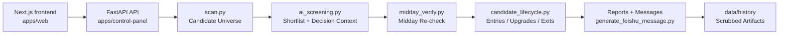

# Prism

Chinese version: [README.zh-CN.md](README.zh-CN.md)

Prism is a full-source AI-native investment research system.

This repository publishes the real control panel, real workflow logic, real prompts, real thresholds, and real historical outputs of the Prism system.

It excludes only secrets, login state, proxy credentials, and privacy-sensitive traces.

## Why This Repo Exists

Most open-source investing repositories publish either toy demos or isolated utilities. Prism takes a different route: it publishes the real operating shape of an AI-native research system.

This repo is meant to show how the system is actually organized end to end:

- how a control panel triggers workflows
- how the screener narrows candidates
- how AI screening and midday verification refine decisions
- how reports and operational artifacts are generated
- how historical outputs are retained after mechanical privacy scrub

## What Is Open Here

This repository includes the real public version of Prism:

- the Prism frontend built with Next.js + React
- the FastAPI backend API for data, tasks, artifacts, and runtime status
- the screening and review workflow scripts
- the real prompts, thresholds, and decision rules used by the system
- the stock-analysis evaluation benchmark, scorecards, and launchers
- the report-generation logic and message formatting
- scrubbed historical outputs, logs, command briefs, and daily snapshots

## What Is Not Open Here

Prism is intentionally full-source, but not secret-leaking.

This repository does **not** publish:

- API keys, tokens, cookies, or webhooks
- login state or browser session traces
- proxy credentials or private endpoints
- personal recipient identifiers
- machine-local absolute paths before scrub

## Repository Layout

```text
prism/
├── apps/web/                  # Next.js + React frontend
├── apps/control-panel/        # FastAPI backend API
├── packages/screener/         # Real screening / review workflows
├── data/history/              # Scrubbed historical artifacts
├── docs/architecture/         # High-level system documentation
├── scripts/scrub-secrets.py   # Mechanical privacy scrub helper
├── tests/                     # Repo-level verification
└── README.zh-CN.md            # Chinese README
```

Important directories:

- `apps/web/`: the only official Prism frontend, including command center, portfolio, discovery, review, settings, and stock detail pages
- `apps/control-panel/`: FastAPI backend API for data assembly, task orchestration, artifact preview, and health checks
- `packages/screener/`: scan, AI screening, midday verification, lifecycle tracking, and message generation
- `data/history/`: archived real outputs including `ai_history/`, `quality_gates/`, `cron_logs/`, `reports/`, `command_brief/`, and `daily_snapshots/`
- `docs/architecture/system.md`: fuller architecture walkthrough for the full-source repo

## System Flow



This diagram shows the main operating loop of the public Prism repository. It focuses on the primary path that turns workflow triggers into decisions, reports, and scrubbed historical artifacts.

For a fuller architectural walkthrough, see [docs/architecture/system.md](docs/architecture/system.md).

## Current Product Frontend

The only official Prism frontend is the Next.js app in `apps/web`. FastAPI no longer serves Jinja pages; it is the backend API.

- `/`: command center for today's stance, action queue, risk alerts, and data sources.
- `/portfolio`: portfolio management, grouped holdings, list management, and refresh controls.
- `/discovery`: opportunity discovery, morning candidates, midday confirmation, and theme radar.
- `/review`: review dashboard for conclusion changes and rule calibration.
- `/settings`: system settings, parameters, task runs, and health status.
- `/stock/[code]`: stock detail page that unifies portfolio and discovery perspectives.
- `Stock evaluation baseline`: a reproducible acceptance layer that scores Prism's stock-analysis behavior and can enforce `professional_usable` or `product_ready` gates.

Legacy paths such as `/today`, `/ask`, `/watchlist`, and `/opportunities` are compatibility redirects only; they are no longer frontend implementations.

## Typical Flow

A simplified Prism operating loop looks like this:

1. The Next frontend, FastAPI API, or shell scripts trigger a workflow.
2. `scan.py` builds a candidate universe.
3. `ai_screening.py` refines it into a shortlist with decision context.
4. `midday_verify.py` re-checks morning conclusions against midday conditions.
5. `candidate_lifecycle.py` tracks entries, upgrades, downgrades, and exits.
6. `generate_feishu_message.py` formats operational reports.
7. Outputs and logs are retained under `data/history/` after scrub.

## Quick Start

Create a virtual environment and install backend dependencies plus test tooling:

```bash
python3 -m venv .venv
. .venv/bin/activate
python -m pip install -r apps/control-panel/requirements.txt
python -m pip install pytest
```

Then install the Next frontend dependencies:

```bash
cd apps/web
npm install
cd ../..
```

Run the verification suite:

```bash
pytest -q
```

Run the privacy scrub pass:

```bash
python3 scripts/scrub-secrets.py
```

If you want to explore Prism locally, start the full stack with one command:

```bash
./start_prism.sh
```

By default this starts the Next frontend at `http://127.0.0.1:8000`, the FastAPI backend API at `http://127.0.0.1:8001`, and the Prism internal scheduler that runs the fixed refresh workflows.
The scheduler only runs on confirmed A-share trading days and skips jobs due in its own startup minute so restarting Prism at an exact cron time does not backfill by surprise. You can override the bind addresses with environment variables such as `PRISM_WEB_PORT`, `PRISM_BACKEND_PORT`, and `PRISM_BACKEND_ORIGIN`. Set `PRISM_ENABLE_SCHEDULER=0` if you want to start only the web/API stack without scheduled refreshes.

Useful routes after startup:

- `http://127.0.0.1:8000/` for the command center
- `http://127.0.0.1:8000/portfolio` for portfolio management
- `http://127.0.0.1:8000/discovery` for opportunities
- `http://127.0.0.1:8000/review` for review
- `http://127.0.0.1:8000/settings` for settings

### Windows Startup

On Windows, use PowerShell and start the FastAPI backend and Next frontend separately:

```powershell
py -3.14 -m venv .venv
.\.venv\Scripts\Activate.ps1
python -m pip install -r apps/control-panel/requirements.txt
python -m pip install pytest
python -m uvicorn control_panel.app:app --host 127.0.0.1 --port 8001
```

Then open another PowerShell window for the web app:

```powershell
cd apps\web
pnpm install
$env:PRISM_BACKEND_ORIGIN="http://127.0.0.1:8001"
pnpm dev -- --hostname 127.0.0.1 --port 8000
```

If `pnpm` is not available, use `npm install` in `apps\web`, then run the local Next binary:

```powershell
$env:PRISM_BACKEND_ORIGIN="http://127.0.0.1:8001"
.\node_modules\.bin\next dev --hostname 127.0.0.1 --port 8000
```

To run Prism's internal scheduler on Windows, keep one additional PowerShell window open:

```powershell
$env:PRISM_REPO_ROOT=(Get-Location).Path
python apps\scripts\prism_scheduler.py
```

The scheduler uses the same task policy as the rest of Prism; it does not depend on macOS `launchd`, Windows Task Scheduler, or OpenClaw.
It uses the same non-trading-day and startup-minute guards as the Unix startup script.

If PowerShell blocks virtualenv activation, enable scripts for the current shell only:

```powershell
Set-ExecutionPolicy -Scope Process -ExecutionPolicy Bypass
.\.venv\Scripts\Activate.ps1
```

If `py -3.14` is not available, install Python 3.14 or newer first. The backend API should stay on `8001`; do not put FastAPI back on `8000` as the frontend.

Confirm the server is healthy:

```powershell
Invoke-WebRequest -UseBasicParsing http://127.0.0.1:8000/healthz
```

After the server starts, open the frontend in a browser:

```text
http://127.0.0.1:8000
```

You can also open a page directly from PowerShell:

```powershell
Start-Process http://127.0.0.1:8000
```

If port `8000` is already in use, change the Next frontend port and set `PRISM_WEB_PORT` accordingly. Do not move the FastAPI backend back onto `8000`.

The shell launchers such as `start_prism.sh` require Bash, WSL, or Git Bash. On plain PowerShell, use the two-window backend/frontend flow above.

If you want to refresh the stock-analysis evaluation artifacts, you can use the one-click launcher:

```bash
./start_stock_evaluation.sh
./start_stock_evaluation.sh professional
./start_stock_evaluation.sh product
```

Modes:

- `baseline`: refresh the latest evaluation report only
- `professional`: require at least `professional_usable` and fail on hard gates
- `product`: require at least `product_ready` and fail on hard gates

## Data And Privacy Model

The repo includes real historical operating artifacts, not just curated samples. That is a deliberate part of the open-source boundary.

Current history buckets include:

- `data/history/ai_history/`: archived AI screening snapshots
- `data/history/quality_gates/`: quality-gate checks and validation outputs
- `data/history/cron_logs/`: workflow execution logs
- `data/history/stale_outputs/`: superseded outputs kept for auditability
- `data/history/reports/`: generated Markdown and text reports
- `data/history/command_brief/`: control-panel decision brief JSON outputs
- `data/history/control_panel_runs/`: task metadata and run logs
- `data/history/daily_snapshots/`: watchlist snapshot inputs referenced by decisions

Before publication, the repo is normalized with `scripts/scrub-secrets.py`, which strips or rewrites privacy-sensitive traces such as:

- local machine paths
- proxy values
- user recipient identifiers
- secret-like markers that require manual review

## Verification Status

The public repo is verified with:

```bash
pytest -q
python3 scripts/scrub-secrets.py
cd apps/web && ./node_modules/.bin/next build
./start_stock_evaluation.sh professional
```

Latest migration verification passed in the public repo before release.

## Architecture Notes

Prism is currently a monorepo. It keeps the real app structure together so that readers can understand how the interface, workflows, and historical artifacts connect.

For a fuller architectural walkthrough of component boundaries, runtime flow, and the public data model, see [docs/architecture/system.md](docs/architecture/system.md).

## Current State

This repository represents the first full-source public release of Prism.

Current emphasis:

- establish the Next.js app as Prism's only official frontend
- keep a one-command startup path for both the UI and the evaluation workflow
- turn stock-analysis changes into a scored acceptance flow with tiered gates
- publish the real operating structure rather than a demo shell
- preserve workflow transparency
- keep privacy scrub mechanical and auditable
- make the repo readable enough for future cleanup and modularization

## Contributing And Security

If you want to contribute, start with [CONTRIBUTING.md](CONTRIBUTING.md).

If you need to report a security or privacy issue, follow [SECURITY.md](SECURITY.md) and avoid opening a public issue with sensitive details.

## License

Prism is released under the license included in [LICENSE](LICENSE).
