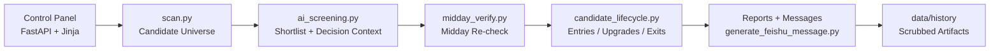

# Prism

Chinese version: [README.zh-CN.md](README.zh-CN.md)

Prism is a full-source AI-native investment research system.

This repository publishes the real control panel, real workflow logic, real prompts, real thresholds, and real historical outputs of the Prism system.

It excludes only secrets, login state, proxy credentials, and privacy-sensitive traces.

## Why This Repo Exists

Most open-source investing repositories publish either toy demos or isolated utilities. Prism takes a different route: it publishes the real operating shape of an AI-native research system.

This repo is meant to show how the system is actually organized end to end:

- how a control panel triggers workflows
- how the screener narrows candidates
- how AI screening and midday verification refine decisions
- how reports and operational artifacts are generated
- how historical outputs are retained after mechanical privacy scrub

## What Is Open Here

This repository includes the real public version of Prism:

- the control-panel frontend built with FastAPI + Jinja templates
- the screening and review workflow scripts
- the real prompts, thresholds, and decision rules used by the system
- the report-generation logic and message formatting
- scrubbed historical outputs, logs, command briefs, and daily snapshots

## What Is Not Open Here

Prism is intentionally full-source, but not secret-leaking.

This repository does **not** publish:

- API keys, tokens, cookies, or webhooks
- login state or browser session traces
- proxy credentials or private endpoints
- personal recipient identifiers
- machine-local absolute paths before scrub

## Repository Layout

```text
prism/
├── apps/control-panel/        # FastAPI + Jinja control panel
├── packages/screener/         # Real screening / review workflows
├── data/history/              # Scrubbed historical artifacts
├── docs/architecture/         # High-level system documentation
├── scripts/scrub-secrets.py   # Mechanical privacy scrub helper
├── tests/                     # Repo-level verification
└── README.zh-CN.md            # Chinese README
```

Important directories:

- `apps/control-panel/`: operator-facing product surface, templates, static assets, tests
- `packages/screener/`: scan, AI screening, midday verification, lifecycle tracking, and message generation
- `data/history/`: archived real outputs including `ai_history/`, `quality_gates/`, `cron_logs/`, `reports/`, `command_brief/`, and `daily_snapshots/`
- `docs/architecture/system.md`: fuller architecture walkthrough for the full-source repo

## System Flow



This diagram shows the main operating loop of the public Prism repository. It focuses on the primary path that turns workflow triggers into decisions, reports, and scrubbed historical artifacts.

For a fuller architectural walkthrough, see [docs/architecture/system.md](docs/architecture/system.md).

## Typical Flow

A simplified Prism operating loop looks like this:

1. The control panel or shell scripts trigger a workflow.
2. `scan.py` builds a candidate universe.
3. `ai_screening.py` refines it into a shortlist with decision context.
4. `midday_verify.py` re-checks morning conclusions against midday conditions.
5. `candidate_lifecycle.py` tracks entries, upgrades, downgrades, and exits.
6. `generate_feishu_message.py` formats operational reports.
7. Outputs and logs are retained under `data/history/` after scrub.

## Quick Start

Create a virtual environment and install the control-panel dependencies plus test tooling:

```bash
python3 -m venv .venv
. .venv/bin/activate
python -m pip install -r apps/control-panel/requirements.txt
python -m pip install pytest
```

Run the verification suite:

```bash
pytest -q
```

Run the privacy scrub pass:

```bash
python3 scripts/scrub-secrets.py
```

If you want to explore the control panel locally, you can start it with one command:

```bash
./start_prism.sh
```

By default this serves `control_panel.app:app` at `http://127.0.0.1:8000`.
You can override the bind address with environment variables such as `PRISM_HOST` and `PRISM_PORT`.

## Data And Privacy Model

The repo includes real historical operating artifacts, not just curated samples. That is a deliberate part of the open-source boundary.

Current history buckets include:

- `data/history/ai_history/`: archived AI screening snapshots
- `data/history/quality_gates/`: quality-gate checks and validation outputs
- `data/history/cron_logs/`: workflow execution logs
- `data/history/stale_outputs/`: superseded outputs kept for auditability
- `data/history/reports/`: generated Markdown and text reports
- `data/history/command_brief/`: control-panel decision brief JSON outputs
- `data/history/control_panel_runs/`: task metadata and run logs
- `data/history/daily_snapshots/`: watchlist snapshot inputs referenced by decisions

Before publication, the repo is normalized with `scripts/scrub-secrets.py`, which strips or rewrites privacy-sensitive traces such as:

- local machine paths
- proxy values
- user recipient identifiers
- secret-like markers that require manual review

## Verification Status

The public repo is verified with:

```bash
pytest -q
python3 scripts/scrub-secrets.py
```

Latest migration verification passed in the public repo before release.

## Architecture Notes

Prism is currently a monorepo. It keeps the real app structure together so that readers can understand how the interface, workflows, and historical artifacts connect.

For a fuller architectural walkthrough of component boundaries, runtime flow, and the public data model, see [docs/architecture/system.md](docs/architecture/system.md).

## Current State

This repository represents the first full-source public release of Prism.

Current emphasis:

- publish the real operating structure rather than a demo shell
- preserve workflow transparency
- keep privacy scrub mechanical and auditable
- make the repo readable enough for future cleanup and modularization

## Contributing And Security

If you want to contribute, start with [CONTRIBUTING.md](CONTRIBUTING.md).

If you need to report a security or privacy issue, follow [SECURITY.md](SECURITY.md) and avoid opening a public issue with sensitive details.

## License

Prism is released under the license included in [LICENSE](LICENSE).
