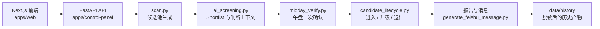

# Prism

English version: [README.md](README.md)

Prism 是一个完整开源的 AI Native 投研系统。

这个仓库公开 Prism 的真实控制台页面、真实工作流逻辑、真实 prompt、真实参数和真实历史运行产物。

它只排除密钥、登录态、代理凭证和隐私敏感痕迹。

## 为什么要有这个仓库

很多开源投研仓库只公开 demo，或者只公开零散脚本。Prism 的目标不一样，它公开的是一个 AI Native 投研系统的真实运行形态。

这个仓库想回答的不是“某个脚本怎么写”，而是：

- 控制台如何触发工作流
- 筛选器如何逐步收敛候选股票
- AI 二筛和午盘确认如何进一步约束判断
- 报告和运行产物如何生成
- 历史产物如何在脱敏后保留下来

## 这里公开了什么

这个仓库公开的是 Prism 的真实公共版本，包括：

- 基于 Next.js + React 的 Prism 前端
- FastAPI 后端 API，用于数据、任务、artifact 和运行状态
- 真实的选股与复核工作流脚本
- 真实使用中的 prompt、阈值和判断规则
- 股票分析验收评估基准、评分产物和一键启动脚本
- 报告生成逻辑与消息格式化逻辑
- 脱敏后的历史运行产物、日志、简报和快照

## 这里没有公开什么

Prism 选择完整开源，但不会泄露秘密。

这个仓库**不会**公开：

- API key、token、cookie、webhook
- 登录态和浏览器会话痕迹
- 代理凭证和私有接口地址
- 个人接收人标识
- 脱敏前的本机绝对路径

## 仓库结构

```text
prism/
├── apps/web/                  # Next.js + React 前端
├── apps/control-panel/        # FastAPI 后端 API
├── packages/screener/         # 真实选股 / 复核工作流
├── data/history/              # 脱敏后的历史运行产物
├── docs/architecture/         # 系统结构说明
├── scripts/scrub-secrets.py   # 机械化脱敏脚本
├── tests/                     # 仓库级验证
└── README.md                  # 英文 README
```

几个重要目录：

- `apps/web/`：Prism 的唯一正式前端，包含指挥中心、持仓、观察池、复盘、设置和单股详情页
- `apps/control-panel/`：FastAPI API 后端，负责数据装配、任务触发、artifact 预览和健康检查
- `packages/screener/`：扫描、AI 二筛、午盘确认、候选生命周期、消息生成
- `data/history/`：真实归档产物，包括 `ai_history/`、`quality_gates/`、`cron_logs/`、`reports/`、`command_brief/`、`daily_snapshots/`
- `docs/architecture/system.md`：更完整的公开仓架构说明

## 系统流程图



这张图展示的是公开版 Prism 的主运行链路，强调的是从触发工作流到生成判断、报告以及脱敏归档的核心路径。

如果你想顺着这条主链路继续看模块边界和数据边界，可以直接看 [docs/architecture/system.md](docs/architecture/system.md)。

## 当前产品前端

Prism 当前唯一正式前端是 `apps/web` 里的 Next.js 应用。FastAPI 不再承载 Jinja 页面，只作为后端 API。

- `/`：指挥中心，汇总今日结论、待办动作、风险提醒和数据源。
- `/portfolio`：持仓管理，把持仓分组、名单管理和刷新入口放在同一页。
- `/discovery`：观察池，承接早盘候选、午盘确认和主线雷达。
- `/review`：复盘页，用于查看结论变化和规则校准。
- `/settings`：系统设置、参数配置、运行任务和健康状态。
- `/stock/[code]`：单股详情页，统一展示持仓视角和观察池视角。
- `股票分析验收基准`：一套可复现的内部评估层，可以给 Prism 当前股票分析能力打分，并执行 `professional_usable` 或 `product_ready` 的门槛检查。

旧的 `/today`、`/ask`、`/watchlist`、`/opportunities` 路径只保留为兼容跳转，不再是前端页面实现。

## 典型工作流

可以把 Prism 的运行主链路理解成这样：

1. Next 前端、FastAPI API 或 shell 脚本触发一个工作流。
2. `scan.py` 生成候选股票池。
3. `ai_screening.py` 进一步压缩成 shortlist，并附带判断上下文。
4. `midday_verify.py` 在午盘重新验证晨间结论。
5. `candidate_lifecycle.py` 跟踪进入、升级、降级和退出。
6. `generate_feishu_message.py` 负责把结果整理成操作报告。
7. 产物和日志在脱敏后保留到 `data/history/`。

## 快速开始

先创建虚拟环境，并安装后端依赖和测试工具：

```bash
python3 -m venv .venv
. .venv/bin/activate
python -m pip install -r apps/control-panel/requirements.txt
python -m pip install pytest
```

然后安装 Next 前端依赖：

```bash
cd apps/web
npm install
cd ../..
```

运行测试：

```bash
pytest -q
```

运行脱敏检查：

```bash
python3 scripts/scrub-secrets.py
```

如果你想本地看 Prism，可以直接一键启动：

```bash
./start_prism.sh
```

默认会启动三层服务：Next 前端在 `http://127.0.0.1:8000`，FastAPI 后端 API 在 `http://127.0.0.1:8001`，以及 Prism 内置调度器，用来执行固定时间的刷新任务。
调度器只会在确认的 A 股交易日运行任务，并且会跳过自己启动所在分钟内正好到点的任务，避免在 cron 时间点重启 Prism 时意外补跑。
如果只想启动页面和 API，不启动定时刷新，可以设置 `PRISM_ENABLE_SCHEDULER=0`。

几个常用页面：

- `http://127.0.0.1:8000/`：指挥中心
- `http://127.0.0.1:8000/portfolio`：持仓管理
- `http://127.0.0.1:8000/discovery`：观察池
- `http://127.0.0.1:8000/review`：复盘
- `http://127.0.0.1:8000/settings`：设置

### Windows 启动方式

Windows 下建议使用 PowerShell，分别启动 FastAPI 后端和 Next 前端：

```powershell
py -3.14 -m venv .venv
.\.venv\Scripts\Activate.ps1
python -m pip install -r apps/control-panel/requirements.txt
python -m pip install pytest
python -m uvicorn control_panel.app:app --host 127.0.0.1 --port 8001
```

另开一个 PowerShell 窗口启动前端：

```powershell
cd apps\web
pnpm install
$env:PRISM_BACKEND_ORIGIN="http://127.0.0.1:8001"
pnpm dev -- --hostname 127.0.0.1 --port 8000
```

如果没有 `pnpm`，也可以在 `apps\web` 下使用 `npm install`，再直接运行本地 Next 二进制：

```powershell
$env:PRISM_BACKEND_ORIGIN="http://127.0.0.1:8001"
.\node_modules\.bin\next dev --hostname 127.0.0.1 --port 8000
```

Windows 下如果要启动 Prism 内置调度器，再开一个 PowerShell 窗口执行：

```powershell
$env:PRISM_REPO_ROOT=(Get-Location).Path
python apps\scripts\prism_scheduler.py
```

这个调度器读取 Prism 自己的任务策略，不依赖 macOS `launchd`、Windows Task Scheduler 或 OpenClaw。
它和 Unix 启动脚本使用同一套非交易日与启动分钟保护。

如果 PowerShell 阻止虚拟环境激活，可以只对当前窗口放开脚本执行权限：

```powershell
Set-ExecutionPolicy -Scope Process -ExecutionPolicy Bypass
.\.venv\Scripts\Activate.ps1
```

如果本机没有 `py -3.14`，请先安装 Python 3.14 或更新版本。后端 API 默认使用 `8001`，不要再把 FastAPI 直接挂到 `8000` 作为前端页面。

启动后可以用下面的命令确认服务健康：

```powershell
Invoke-WebRequest -UseBasicParsing http://127.0.0.1:8000/healthz
```

服务启动成功后，直接在浏览器里打开前端页面：

```text
http://127.0.0.1:8000
```

也可以在 PowerShell 里直接打开浏览器：

```powershell
Start-Process http://127.0.0.1:8000
```

如果 `8000` 端口已被占用，请调整 Next 前端端口，并同步设置 `PRISM_WEB_PORT`。不要把 FastAPI 后端端口改到 `8000`。

`start_prism.sh` 这类 shell 启动脚本需要 Bash、WSL 或 Git Bash。纯 PowerShell 环境下，按上面的后端 / 前端两窗口方式启动。

如果你想刷新股票分析验收报告，可以直接用一键脚本：

```bash
./start_stock_evaluation.sh
./start_stock_evaluation.sh professional
./start_stock_evaluation.sh product
```

三种模式分别是：

- `baseline`：只刷新最新评估报告
- `professional`：要求至少达到 `professional_usable`，并在硬门槛失败时直接报错
- `product`：要求达到 `product_ready`，并在硬门槛失败时直接报错

## 数据与脱敏模型

这个仓库包含的不是示例数据，而是真实运行后的历史产物。这是 Prism 开源边界的一部分，而不是附赠演示素材。

当前公开的历史桶包括：

- `data/history/ai_history/`：AI 二筛归档快照
- `data/history/quality_gates/`：质量闸门和校验结果
- `data/history/cron_logs/`：工作流执行日志
- `data/history/stale_outputs/`：被新产物替换但保留审计价值的旧结果
- `data/history/reports/`：生成出来的 Markdown / 文本报告
- `data/history/command_brief/`：控制台决策简报 JSON
- `data/history/control_panel_runs/`：控制台任务运行元数据与日志
- `data/history/daily_snapshots/`：决策所引用的自选股快照输入

在公开前，仓库会通过 `scripts/scrub-secrets.py` 做机械化脱敏，主要处理：

- 本机路径
- 代理地址
- 用户接收人标识
- 需要人工复查的敏感标记

## 当前验证状态

公共仓当前使用下面两条命令做验证：

```bash
pytest -q
python3 scripts/scrub-secrets.py
cd apps/web && ./node_modules/.bin/next build
./start_stock_evaluation.sh professional
```

最近一次公开迁移发布前，这两项验证都已通过。

## 架构说明

Prism 当前采用 monorepo 结构，把真实控制台、真实工作流和历史产物放在同一个公开代码库里，方便一次性理解系统全貌。

如果你想看更正式一点的架构说明，包括模块边界、运行链路和公开数据模型，可以直接看 [docs/architecture/system.md](docs/architecture/system.md)。

## 当前阶段

这个仓库对应的是 Prism 的第一个完整公开版本。

当前重点是：

- 将 Next.js 前端确立为 Prism 的唯一正式前端
- 给 UI 和评估流程都补上一键启动入口
- 把股票分析改造纳入带层级门槛的验收流程
- 公开真实系统，而不是保留一个演示壳子
- 保留工作流透明度
- 让脱敏过程尽量机械化、可复查
- 先把仓库公开完整，再逐步做后续模块化整理

## 参与与安全

如果你想参与这个仓库，先看 [CONTRIBUTING.md](CONTRIBUTING.md)。

如果你发现的是安全或隐私问题，请按 [SECURITY.md](SECURITY.md) 的方式私下报告，不要先把敏感细节公开发到 issue。

## License

Prism 使用 [LICENSE](LICENSE) 中提供的许可证。
