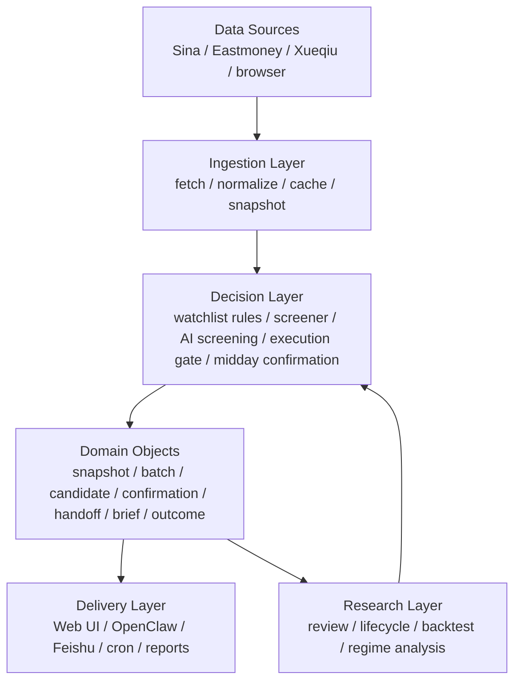

# Prism System Blueprint v1

Date: 2026-04-17
Owner: invest workspace
Status: agreed direction, ready for phased execution

## 1. Decision

Prism should no longer be defined as "two OpenClaw investment functions".

It should evolve into an independent investment system with three product domains:

1. `Watchlist Manager`
   For fixed watchlist / holdings management.
   Core question: "Among the stocks I already care about, what should I do today?"
2. `Discovery Engine`
   For aggressive market-wide opportunity discovery and intraday confirmation.
   Core question: "What new opportunities deserve promotion today?"
3. `Command Center`
   For daily synthesis, ranking, promotion, downgrade, and handoff decisions.
   Core question: "What should I look at first right now?"

OpenClaw should become one access layer of Prism, not the host of Prism's business logic.

## 2. What The Current System Already Is

The current implementation has already crossed the line from "prompt + script helper" into "decision workflow system":

- `stock-analyzer` is a watchlist decision engine with snapshots, rule guards, trigger levels, and Feishu summaries.
- `stock-screener` is an opportunity discovery engine with scan, AI screening, execution-quality gates, midday refresh, and midday confirmation.
- `invest-flow/control_panel` is an operations console for reruns, quality checks, and artifact preview.

So the correct framing is:

- `control_panel` is an internal operator console
- `stock-analyzer` is not the same product as `stock-screener`
- the real product is the unified Prism decision system above them

## 3. Product Boundary

### 3.1 Watchlist Manager

Scope:

- fixed watchlist / holdings analysis
- daily snapshot generation
- action guardrails
- support / resistance / stop-loss anchors
- action ranking and mobile summary

Output:

- per-stock snapshot
- daily watchlist brief
- daily watchlist full report
- stock detail page / API response

Non-goal:

- discovering new market opportunities from the full universe

### 3.2 Discovery Engine

Scope:

- aggressive pool scan
- AI secondary screening
- execution-quality gating
- midday refresh
- midday confirmation
- screener to analyzer handoff

Output:

- screening batch
- shortlisted candidates
- midday confirmed / downgraded set
- handoff candidates
- opportunity board

Non-goal:

- acting as the final "today's decision board" by itself

### 3.3 Command Center

Scope:

- merge watchlist and discovery outputs
- show what is urgent now
- explain upgrades / downgrades
- decide what goes to deep analysis
- produce one final daily brief

Output:

- daily command brief
- today's priority queue
- promoted / downgraded / archived decisions
- operator view for manual intervention

Non-goal:

- replacing the underlying engines

## 4. Product Surface

Prism should eventually expose five surfaces.

1. `Today`
   The main decision board. One screen answers:
   - what to look at first
   - what became stronger
   - what lost confirmation
   - what is blocked by quality issues
2. `Watchlist`
   A stable board for tracked names, with action, risk, trigger lines, and change versus previous snapshot.
3. `Opportunities`
   A board for new candidates from the aggressive engine, including setup, execution quality, consistency, and midday status.
4. `Review`
   A history / replay / research surface for checking outcomes, friction-adjusted edge, and regime performance.
5. `Ops`
   The existing control panel class of functionality:
   reruns, logs, quality gate, artifact preview, delivery state.

Important rule:
`Ops` is not the main product homepage.

## 5. Layered Architecture

### 5.1 Ingestion Layer

Responsibilities:

- quote / fund flow / fundamentals / sector / news / announcement ingestion
- normalization and fallback routing
- cache and daily snapshot persistence
- timestamp hygiene

### 5.2 Decision Layer

Responsibilities:

- watchlist action rules
- screener scan and AI screening
- execution-quality gating
- midday refresh and confirmation
- handoff routing
- quality gate before delivery

### 5.3 Domain Object Layer

This is the future backbone.

All delivery channels should read from canonical domain objects first, then render to:

- JSON
- web cards
- Feishu brief
- full report
- OpenClaw response

OpenClaw should not depend on raw internal script side effects.

### 5.4 Delivery Layer

Responsibilities:

- render web pages
- expose stable API / CLI
- trigger jobs
- generate Feishu outputs
- support OpenClaw integration

### 5.5 Research Layer

Responsibilities:

- lifecycle tracking
- backtest review
- regime segmentation
- friction-adjusted performance review
- rule effectiveness analysis

This layer is essential because current historical edge is not yet proven strong enough.

## 6. Canonical Data Model

Prism should standardize around the following entities.

### 6.1 `watchlist_snapshot`

Represents one stock in the fixed watchlist on one date.

Suggested fields:

- `date`
- `code`
- `name`
- `source_batch_id`
- `realtime`
- `flow`
- `fundamentals`
- `sector`
- `rule_snapshot`
- `trade_levels`
- `intraday_triggers`
- `action_rank`
- `change_vs_previous`

### 6.2 `screening_batch`

Represents one screener run.

Suggested fields:

- `batch_id`
- `run_type` (`morning`, `midday_refresh`, `midday_confirmation`)
- `pool`
- `started_at`
- `finished_at`
- `market_regime`
- `scan_summary`
- `quality_status`

### 6.3 `candidate`

Represents one discovered opportunity inside one screening batch.

Suggested fields:

- `batch_id`
- `code`
- `name`
- `strategy`
- `setup_type`
- `priority_score`
- `consistency`
- `execution_quality`
- `risk_flags`
- `status`

### 6.4 `confirmation`

Represents the midday result of a morning candidate.

Suggested fields:

- `morning_batch_id`
- `midday_batch_id`
- `code`
- `status` (`confirmed`, `downgraded`, `invalid`, `missing_baseline`)
- `score_delta`
- `change_delta`
- `confirmation_label`
- `reasons`

### 6.5 `handoff`

Represents a screener candidate that enters deep analysis.

Suggested fields:

- `source_batch_id`
- `code`
- `handoff_reason`
- `priority_tier`
- `analyzer_status`
- `linked_report_paths`

### 6.6 `decision_brief`

Represents the final command-center output for one time window.

Suggested fields:

- `brief_id`
- `generated_at`
- `watchlist_priorities`
- `discovery_priorities`
- `upgrades`
- `downgrades`
- `blocked_items`
- `recommended_focus`
- `delivery_status`

### 6.7 `outcome`

Represents post-fact result tracking.

Suggested fields:

- `source_type`
- `source_id`
- `code`
- `next_return`
- `three_day_return`
- `five_day_return`
- `max_favorable_excursion`
- `max_adverse_excursion`
- `regime_tag`

## 7. OpenClaw Boundary

Future rule:
OpenClaw should talk to Prism through stable capabilities, not by knowing raw file names and workflow internals.

### 7.1 Recommended capability boundary

OpenClaw should be able to call:

- `run_watchlist(date?, send=false)`
- `run_aggressive_scan(pool="aggressive", send=false)`
- `run_midday_refresh(pool="aggressive", send=false)`
- `run_midday_confirmation(pool="aggressive", send=false)`
- `get_today_brief()`
- `get_watchlist_snapshot(code, date?)`
- `get_candidate_detail(code, batch_id?)`
- `get_quality_status(lane?)`

### 7.2 Recommended return shape

Each capability should return:

- machine-readable JSON
- artifact references
- delivery-safe summary text

OpenClaw then chooses how to present it:

- chat reply
- Feishu message
- cron execution summary

### 7.3 Explicit anti-patterns

Avoid these in the long term:

- OpenClaw directly depending on internal report file naming
- channel-specific prompt logic owning business rules
- different channels rendering from different source truths
- control panel button definitions becoming the de facto public API

## 8. What To Build Next

The next step is not "make a prettier page".

The next step is to separate system core from current ops shell.

### Phase 0: Stabilize Existing Chains

Goal:
ensure current watchlist / aggressive / midday flows run reliably day to day.

Exit criteria:

- morning watchlist stable
- aggressive morning stable
- midday refresh stable
- midday confirmation stable
- quality gate pass / fail states are trustworthy

### Phase 1: Extract Prism Core

Goal:
introduce a canonical data contract.

Key work:

- unify batch ids and timestamps across flows
- define canonical JSON schemas
- isolate renderers from business logic
- make command brief consume structured objects instead of loose artifacts

Exit criteria:

- all delivery surfaces can be generated from canonical objects
- raw scripts remain implementation detail

### Phase 2: Build Real Product Surfaces

Goal:
move from ops console to product views.

Key work:

- `Today` page
- `Watchlist` board
- `Opportunities` board
- `Review` page
- keep `Ops` as a separate admin surface

Exit criteria:

- user can understand "today's situation" without opening logs or raw reports

### Phase 3: Close The Research Loop

Goal:
prove or reject edge, not just generate reports.

Key work:

- lifecycle default integration
- regime switching
- announcement body parsing
- outcome tracking by setup / regime / execution quality
- friction-adjusted scoreboards

Exit criteria:

- Prism can say which setup works, in what market, with what quality threshold

## 9. Immediate Priority List

If execution starts now, the most leverage-heavy next items are:

1. Freeze the product vocabulary.
   Use `Watchlist Manager`, `Discovery Engine`, `Command Center`, `Ops`.
2. Define canonical JSON schemas for:
   - `watchlist_snapshot`
   - `screening_batch`
   - `candidate`
   - `confirmation`
   - `decision_brief`
3. Add one stable read entrypoint for Prism outputs.
   CLI or lightweight API is enough for v1.
4. Split the current control panel roadmap.
   Keep it for rerun / quality / artifacts only.
5. Promote `decision_brief` into the real homepage concept.
6. Start an explicit outcome-tracking baseline.
   The system must measure whether recommendation quality survives friction.

## 10. North Star

Prism should eventually answer five questions every trading day:

1. Which existing watchlist names need action right now?
2. Which new opportunities deserve promotion?
3. Which morning ideas kept their edge at midday?
4. Which signals were blocked because quality or consistency failed?
5. Which rule families are still proving real edge after friction?

If Prism can answer those five reliably, it is no longer an OpenClaw add-on.
It is the investment system itself.
