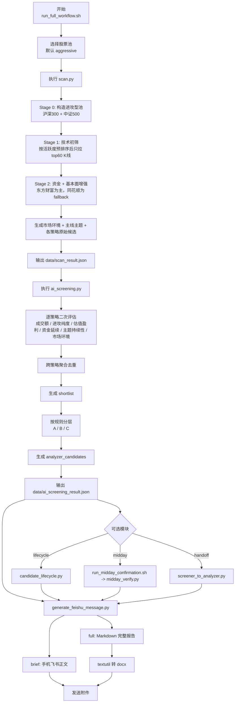
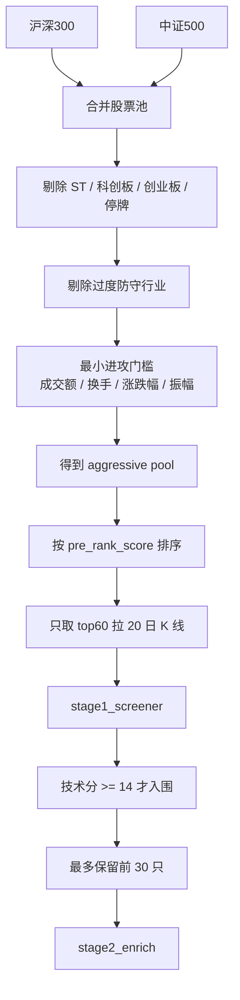
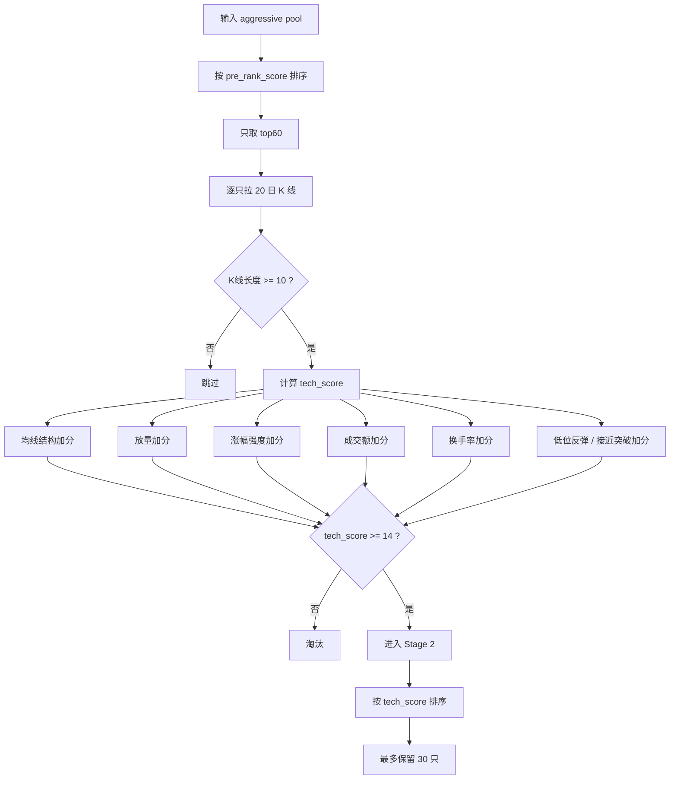
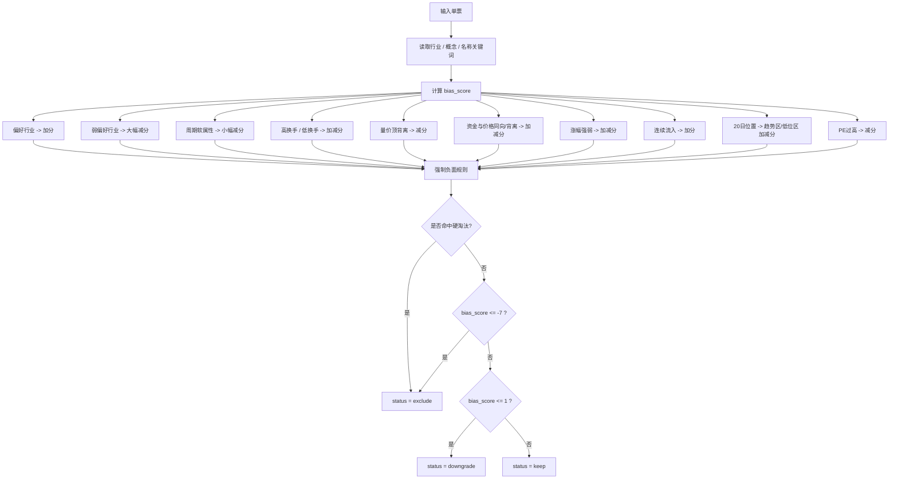
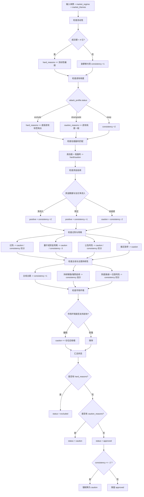
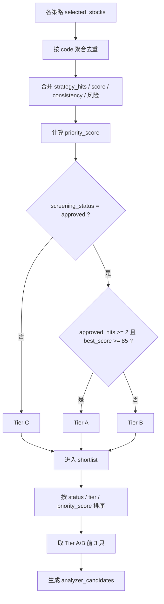
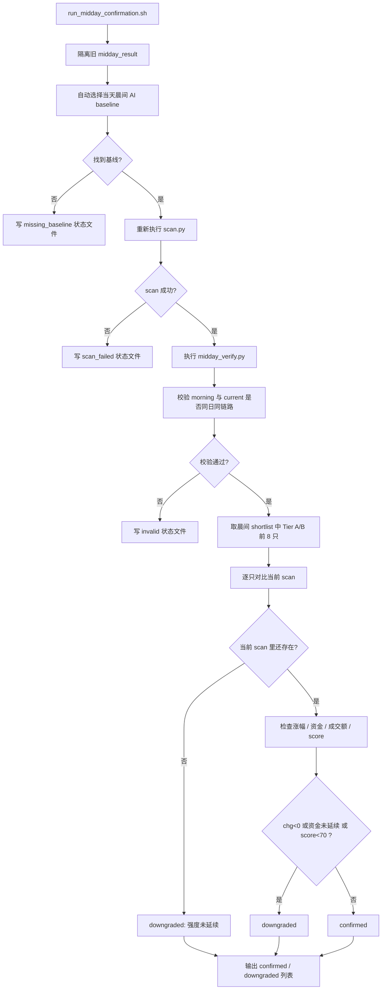
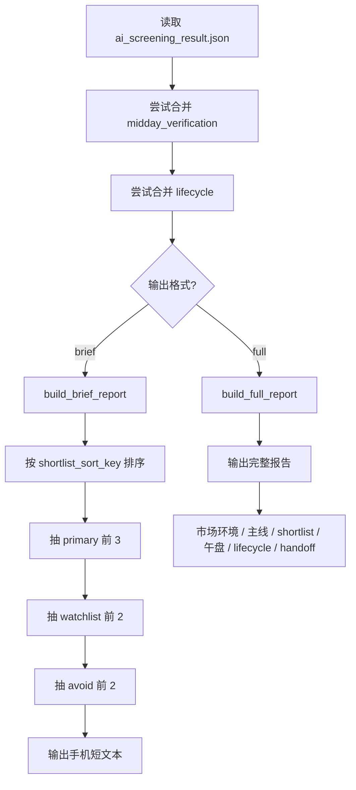

# 进攻型股票选股逻辑流程图

版本日期：2026-04-14

适用范围：这份文档对应当前 `stock-screener` 的真实实现，重点是“进攻型股票池”的早盘扫描、二次筛选、午盘确认、Analyzer 接力和飞书输出逻辑。

核心代码锚点：
- `skills/stock-screener/scripts/run_full_workflow.sh`
- `skills/stock-screener/scripts/scan.py`
- `skills/stock-screener/scripts/ai_screening.py`
- `skills/stock-screener/scripts/midday_verify.py`
- `skills/stock-screener/scripts/run_midday_confirmation.sh`
- `skills/stock-screener/scripts/candidate_lifecycle.py`
- `skills/stock-screener/scripts/screener_to_analyzer.py`
- `skills/stock-screener/scripts/generate_feishu_message.py`

## 1. 当前系统本质

这套系统不是“全市场无边界找妖股”，也不是“分钟级量化交易系统”。

它当前更准确的定位是：

1. 先从 `沪深300 + 中证500` 构造一个受控的进攻型候选池。
2. 用 `scan.py` 先做一轮规则化漏斗，把明显不活跃、不够进攻、无资金支撑的票过滤掉。
3. 再用 `ai_screening.py` 做二次风控和分层，得到 `shortlist + A/B/C tier + analyzer_candidates`。
4. 可选接入午盘确认、生命周期管理、Analyzer 深度分析和飞书摘要。

所以它本质上是一个“池化进攻型候选发现与分层系统”，不是全市场自由搜索器。

## 2. 总体流程图



## 3. 股票池与扫描漏斗

这套系统最值得先给专家讲清楚的，是它一开始就不是全市场扫描。

### 3.1 股票池来源

`load_aggressive_pool_with_quotes()` 的逻辑：

1. 拉取 `hs300`
2. 拉取 `zz500`
3. 合并去重
4. 剔除：
   - `ST/*ST`
   - 科创板 `68*`
   - 创业板 `30*`
   - 停牌或成交额为 0
   - 明显防守方向，如银行、保险、高速、港口、机场、电力、燃气、铁路、运营
5. 再加一道最小进攻门槛：
   - 成交额至少 `5e8`
   - 且满足以下其一：
     - 换手率 `>= 2%`
     - 涨跌幅绝对值 `>= 1.5%`
     - 日内振幅 `>= 3%`
     - 来自 `中证500`

### 3.2 扫描漏斗图



### 3.3 这里隐含的系统性偏置

这套设计天然会偏向：

1. 主板大中盘中的相对活跃票
2. 有一定流动性、可交易性的票
3. 更容易捕捉“趋势延续”和“资金推动”，而不是最早期的小盘启动点

它天然会漏掉：

1. 全市场更小票的强势品种
2. 创业板、科创板的高弹性方向
3. 成交额还没明显放大、但刚准备启动的票

## 4. `scan.py` 的核心逻辑

`scan.py` 其实是整个系统最重要的第一层。它决定“什么票能进入后面的二筛视野”。

### 4.1 Stage 1 技术初筛

`stage1_screener()` 先按 `pre_rank_score` 预排序，再只对 top60 拉取 20 日 K 线做技术评分。

`pre_rank_score` 主要看：

- 成交额
- 涨跌幅绝对值
- 换手率
- 日内振幅

然后技术分 `tech_score` 主要由以下因素组成：

1. 均线结构
   - 强多头：`close > MA5 > MA10 > MA20`
   - 多头：`close > MA5 > MA10`
2. 量能放大
3. 当日涨幅强度
4. 成交额活跃度
5. 换手弹性
6. 20 日位置
   - 低位反弹
   - 接近突破

技术分 `>=14` 才能入围 Stage 2。

### 4.2 Stage 1 决策图



### 4.3 Stage 2 资金与基本面增强

`stage2_enrich()` 会对 Stage 1 的候选做更重的数据补齐：

1. 资金流：
   - 优先东方财富批量当日快照
   - 再用东方财富单票
   - 再用历史数据
   - 最后回退同花顺页面抓取
2. 基本面：
   - 优先东方财富批量快照 + 缓存
   - 必要时打 `stock/get`
   - 关键值缺失再回退同花顺
3. 公告：
   - 拉最近 5 条
   - 做风险标签分类

然后生成 4 类分数：

1. `tech_score`
2. `cap_score`
3. `fund_score`
4. `emotion_score`

再叠加两个惩罚项：

1. `missing_cap_penalty`
2. `overheat_penalty`

最终总分：

```text
final_score =
  tech_score * 1.25
  + cap_score * 1.2
  + emotion_score * 1.15
  + fund_score * 0.55
  - missing_cap_penalty
  - overheat_penalty
```

### 4.4 Stage 2 的关键倾向

当前配方很明显偏向：

1. 技术优先
2. 资金优先
3. 情绪增强
4. 基本面轻权重

也就是说，它本质上是在做“偏短线/波段的进攻型排名”，不是价值发现。

## 5. `classify_attack_profile()` 进攻纯度判断

这一步非常关键，因为它不是单纯打分，而是在做“进攻型身份校验”。

它会输出三档：

- `keep`
- `downgrade`
- `exclude`

核心依据包括：

1. 风格关键词是否属于偏好的进攻方向
2. 是否命中弱偏好行业
3. 是否带有周期股软惩罚
4. 换手是否够
5. 量价顶背离强不强
6. 资金是否和价格同向
7. 当日涨幅是否够强
8. 是否连续流入
9. 20 日位置是否处于趋势区
10. 高估值是否压制

### 5.1 进攻纯度判断图



## 6. 主线主题与市场环境判断

这是和一般简单选股脚本差别很大的地方。

### 6.1 市场环境 `assess_market_regime()`

市场环境不是宏观指数模型，而是用候选池横截面做简易判断：

1. 上涨占比
2. 平均涨幅
3. 平均换手
4. 强势股占比

最后给出：

- `进攻环境较强`
- `中性偏进攻`
- `偏谨慎`

并且保留两种口径：

1. `pool`：股票池全样本
2. `candidate`：已入围候选样本

系统会特别提醒两者差异，避免把候选强度误当成整体市场环境。

### 6.2 主线主题 `assess_market_themes()`

主题判断不是只看出现次数，而是综合：

1. 候选加权数量
2. 龙头强度
3. 资金集中度
4. 结构完整度
5. 风格纯度
6. 最近历史的持续性

最后给每个主题生成：

- `score`
- `leader_codes`
- `persistence.score`
- `persistence.label`
- `persistence.summary`

常见标签包括：

- `持续增强`
- `强势延续`
- `延续但分化`
- `热度衰减`
- `一日游风险`

## 7. `ai_screening.py` 的二次筛选逻辑

`scan.py` 负责“把票找出来”，`ai_screening.py` 负责“哪些能进入执行层”。

### 7.1 单票二筛的核心判断

`evaluate_stock()` 会同时产出：

- `status`
  - `approved`
  - `caution`
  - `excluded`
- `reason`
- `hard_reasons`
- `caution_reasons`
- `positive_signals`
- `consistency_score`
- `consistency_label`

它的主要逻辑包括：

1. 成交额是否足够
2. `attack_profile` 是否已被底层淘汰
3. 估值与盈利是否错配
4. 资金是否继续净流入
5. 是否过热
6. 是否量价/资金背离
7. 公告是否带来实质风险
8. 是否接近涨停
9. 是否属于主线主题
10. 主题持续性是否足够
11. 当前市场环境是否支持进攻
12. 是否给出了清晰的次日观察条件

### 7.2 单票二筛决策图



### 7.3 跨策略聚合与 A/B/C 分层

`aggregate_shortlist()` 会把多策略结果合并，并做去重。

聚合后每只股票会得到：

1. `strategy_hits`
2. `approved_hits`
3. `caution_hits`
4. `best_score`
5. `consistency`
6. `priority_score`

然后再分层：

- `A`
  - `approved`
  - 且 `approved_hits >= 2`
  - 且 `best_score >= 85`
- `B`
  - `approved`
  - 但未满足 A
- `C`
  - 其余全部

并生成：

- `shortlist`
- `analyzer_candidates`
- `screening_summary`

### 7.4 分层与 Analyzer 候选图



## 8. 午盘确认逻辑

午盘确认不是简单“再跑一遍报告”，而是严格验证“当前午盘扫描”是否和“同日同批次晨间 shortlist”匹配。

### 8.1 `run_midday_confirmation.sh` 的保护动作

它会先做三件很关键的事：

1. 隔离旧的 `midday_verification_result.json`
2. 自动寻找当天上午有效的晨间 AI shortlist 基线
   - 优先 `10:*` 批次
3. 找不到基线时，明确写 `missing_baseline`

这一步是为了解决“旧文件串味”和“拿错晨间批次做午盘确认”的问题。

### 8.2 `midday_verify.py` 的判断逻辑

先校验输入是否同日、是否时间顺序正确，然后只验证晨间 `A/B` 层前 8 只。

单票规则：

1. 当前扫描里已经消失 -> 直接降级
2. 盘中涨幅转负 -> 降级
3. 主力资金未延续且未转正 -> 降级
4. 盘中综合分掉到 `70` 以下 -> 降级
5. 成交额不足 5 亿 -> 记风险，但不一定立即否决

### 8.3 午盘确认图



## 9. 生命周期与 Analyzer 接力

### 9.1 生命周期 `candidate_lifecycle.py`

生命周期不是选股本身，而是帮助理解“候选池在怎么变化”。

它会把当前 shortlist 与最近历史基线对比，识别：

- `entered`
- `upgraded`
- `downgraded`
- `exited`
- `handed_off`

这里有两个很重要的设计：

1. 优先与历史 `ai_screening` 归档对比
2. 只有在午盘确认和当前 AI shortlist 匹配时，才把午盘确认结果并入生命周期

### 9.2 Analyzer 接力 `screener_to_analyzer.py`

Analyzer 接力规则当前非常清晰：

1. 只看 `analyzer_candidates`
2. `A` 层直接允许
3. `B` 层要求 `consistency >= min_consistency`
4. 默认取前 3
5. 然后调用 `stock-analyzer/scripts/fetch.py --codes ...`

所以这里不是“所有 shortlist 都深度分析”，而是先由 screener 做一道接力门。

## 10. 飞书摘要与完整报告

### 10.1 `generate_feishu_message.py` 的输入拼接规则

它会以 `ai_screening_result.json` 为主输入，然后按条件尝试拼接：

1. 午盘确认
   - 必须 `validation_status == ok`
   - 且 `source_morning_timestamp == ai_result.timestamp`
   - 且 `source_scan_timestamp == ai_result.source_scan_timestamp`
2. 生命周期
   - 必须 `metadata.current_timestamp == ai_result.timestamp`

只有匹配成功才会并入最终报告。

### 10.2 手机飞书正文的压缩逻辑

`build_brief_report()` 会把 shortlist 压缩成三组：

1. `primary`
   - `approved`
   - 且 `tier in {A, B}`
   - 只取前 3
2. `watchlist`
   - 未进入 primary
   - 且 `tier == B` 或 `screening_status == caution`
   - 只取前 2
3. `avoid`
   - 再从剩余里找
   - `caution` 或 “别追” 标签
   - 只取前 2

输出给手机端时，重点只保留：

1. 今天能不能做
2. 今天主线是什么
3. 先看哪几只
4. 候补观察哪些
5. 今天哪些别追

### 10.3 飞书压缩图



## 11. 我对这套系统的直白判断

它已经不是“扫一下热门股”的简单脚本了，而是一套相当完整的进攻型候选发现系统：

1. 有受控股票池
2. 有两阶段筛选
3. 有主题和环境判断
4. 有二次风控和分层
5. 有午盘确认
6. 有生命周期和 Analyzer 接力
7. 有手机优先的飞书输出

但它也有非常明显的系统性特征：

1. 偏主板大中盘活跃票
2. 偏趋势延续和资金推动
3. 对最早启动点、超高弹性板块覆盖有限
4. 对执行层的判断仍然是规则型，不是统计学习型

## 12. 建议你拿给投资大神重点问这 10 个问题

1. 当前把股票池限制在 `沪深300 + 中证500`，是否太保守，是否会系统性漏掉最强进攻票。
2. `stage1_screener()` 只对 `pre_rank_score` 前 60 只拉 K 线，这一步会不会把真正该看的票过早过滤掉。
3. 当前 `final_score` 的权重组合是否合理，尤其是 `tech / capital / emotion / fundamental` 的相对比例。
4. `classify_attack_profile()` 这种行业关键词驱动的“进攻纯度”判断是否够稳，是否应该行业分层而不是关键词减分。
5. 主题识别里把“持续性”纳入评分是好事，但这种基于近几次历史快照的方式，是否足够代表真实板块周期。
6. `ai_screening.py` 里把 `consistency_score` 作为二筛核心，思路对不对，还是应该拆成更明确的因子桶。
7. `A/B/C` 分层规则是否过于依赖 `approved_hits` 和 `best_score`，是否还应加入更明确的成交额或资金硬门槛。
8. 午盘确认目前主要看 `涨幅 / 资金 / score / 成交额`，这是否足够，是否还应加入分时承接或回落结构。
9. 飞书简报当前压缩得很狠，是否该在第一屏额外补一条“今天为什么先看它”的硬解释。
10. 这套系统是否应该拆成两个子系统：
   - `候选发现`
   - `执行确认`

## 13. 一句话结论

当前这套进攻型逻辑，已经具备“可讨论、可迭代、可被专业人士审视”的结构基础。

它最大的价值不在于“现在就一定选得最强”，而在于它已经从“主观感觉选股”升级成了“有池子、有漏斗、有风控、有分层、有午盘复核、有手机交付”的系统。

如果你愿意，我下一步还能继续帮你做一版“专家评审版单页图”：

1. 左边放当前系统流程
2. 右边放潜在薄弱点和建议提问
3. 更适合直接转发给那位投资大神
