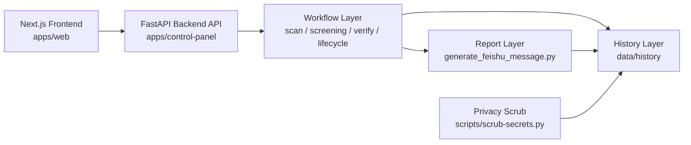

# Prism System Architecture

Prism is the first public full-source release of the Prism investment research system. The repository keeps the real operator interface, real workflow code, and real scrubbed historical outputs together so readers can understand how the system actually runs rather than reading an isolated demo.

## Architecture Goals

Prism is organized around four goals:

- show the real operating shape of the system end to end
- keep the operator entrypoint close to the workflow code it triggers
- preserve historical outputs after mechanical privacy scrub
- make the public repository readable enough for later cleanup and modularization

## Top-Level View



The Next.js app is the operator-facing surface. It calls the FastAPI backend API to trigger workflow execution, the workflow layer produces decisions and intermediate artifacts, the report layer formats operational output, and the history layer retains scrubbed records for transparency and auditability.

## Primary Runtime Chain

The main public operating loop is:

1. The operator uses the Next.js frontend, FastAPI API, or shell entrypoints to trigger a run.
2. `scan.py` builds the candidate universe.
3. `ai_screening.py` narrows that universe into a shortlist with decision context.
4. `midday_verify.py` re-checks the morning view against midday conditions.
5. `candidate_lifecycle.py` updates entry, upgrade, downgrade, and exit state.
6. `generate_feishu_message.py` formats the final operational message or report artifact.
7. Run outputs are retained under `data/history/` after privacy scrub.

## Component Boundaries

### 1. Frontend Surface

Path: `apps/web/`

This app provides the public operator-facing UI. It is the only official Prism frontend and contains the command center, portfolio, discovery, review, settings, and stock detail pages.

### 2. Backend API

Path: `apps/control-panel/`

This app provides the FastAPI backend API. It assembles view data, triggers background tasks, serves artifact previews, and exposes health checks. It no longer owns Jinja pages or static frontend assets.

### 3. Workflow Layer

Path: `packages/screener/`

This package holds the real workflow chain used by Prism. It includes candidate generation, AI-assisted screening, midday verification, lifecycle tracking, and report preparation. The public repository keeps these scripts together because they are easier to understand as one operating chain than as disconnected utilities.

### 4. Reporting Layer

Primary entrypoint: `generate_feishu_message.py`

Prism treats report generation as part of the workflow, not as an afterthought. The reporting layer converts internal decisions into operator-facing summaries, message payloads, and archived report artifacts.

### 5. Historical Artifact Layer

Path: `data/history/`

This folder keeps scrubbed operational artifacts, including AI screening snapshots, quality gates, cron logs, command briefs, generated reports, control-panel run metadata, and daily snapshot inputs. Publishing this layer is part of the open-source boundary because it shows how the system behaves over time.

### 6. Privacy Scrub Layer

Path: `scripts/scrub-secrets.py`

The scrub script is the mechanical guardrail between a real working repository and a public repository. It removes or rewrites machine-local paths, proxy values, recipient identifiers, and similar privacy-sensitive traces before publication.

## Repository Layout

```text
prism/
├── apps/web/                  # Next.js frontend
├── apps/control-panel/        # FastAPI backend API
├── packages/screener/         # Real screening and review workflows
├── data/history/              # Scrubbed historical artifacts
├── docs/architecture/         # Architecture notes for the public repo
├── scripts/scrub-secrets.py   # Mechanical privacy scrub helper
└── tests/                     # Repo-level verification
```

## Data And Privacy Model

Prism is intentionally full-source but not secret-leaking.

The public repository includes:

- real Next.js frontend source
- real workflow scripts and decision rules
- real prompts, thresholds, and report formats
- real historical artifacts after mechanical scrub

The public repository excludes only:

- secrets, tokens, cookies, and webhooks
- login state and browser session traces
- proxy credentials and private endpoints
- personal recipient identifiers
- machine-local absolute paths before scrub

## Verification Model

The public repository currently relies on two simple verification passes:

```bash
pytest -q
python3 scripts/scrub-secrets.py
```

`pytest -q` verifies the public app and repo-level behavior. `scripts/scrub-secrets.py` verifies that privacy normalization still succeeds after changes.

## Why Prism Is Still A Monorepo

Prism has not yet been split into separate public frontend, workflow, and data repositories. That is intentional for the first release.

Keeping the system together currently has three benefits:

- readers can follow the full control-panel-to-report chain without jumping across repositories
- the open-source boundary stays explicit because code and scrubbed artifacts live side by side
- future modularization can happen from a transparent baseline rather than from a reduced demo shell

## Future Direction

The public repository is structured to support later cleanup, but the current priority is clarity over perfect modularity. Likely future work includes clearer internal interfaces, slimmer package boundaries, and more focused documentation for operators versus contributors.
