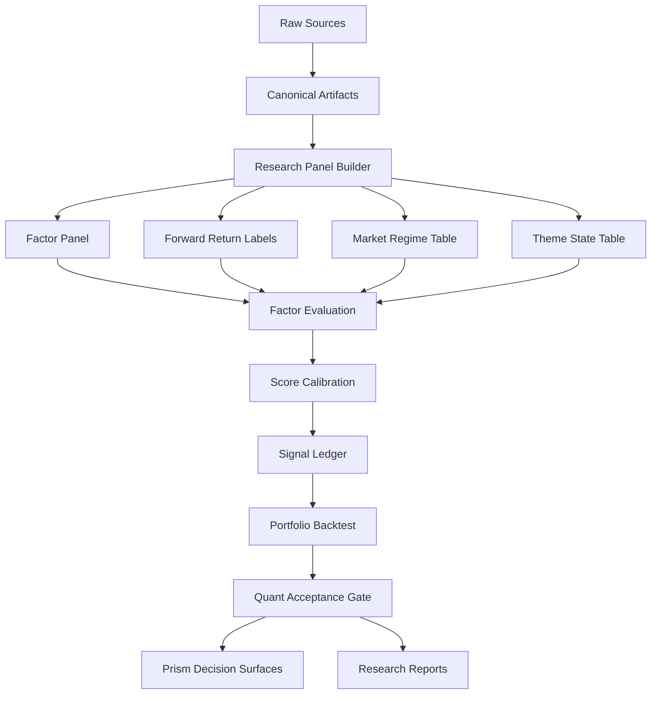

# Prism 量化升级设计文档

Date: 2026-04-27
Owner: Prism research system
Status: design proposal
Scope: A 股短线研究、机会发现、持仓跟踪、执行辅助

## 一句话结论

Prism 下一阶段不应该只是继续增加页面和规则，而是要从“经验型研究系统”升级成“证据驱动的量化研究与决策系统”。

当前 Prism 已经有不错的工作流、风控语言和报告结构，但核心打分、分层、闸门、题材判断还没有被充分绑定到历史收益、风险、胜率、回撤和容量证据上。

这份设计的目标是：在保留 Prism 现有产品体验和风控纪律的基础上，新增一条可复现、可回测、可校准、可验收的量化研究脊柱。

## 当前系统判断

### Prism 当前更像什么

Prism 当前更像一个“短线研究与执行辅助驾驶舱”。

它已经能回答：

- 今天市场能不能进攻
- 哪些股票值得观察
- 哪些票需要等触发
- 哪些票因为环境或执行质量不允许新开仓
- 当前输出是否有数据新鲜度和质量问题

它还不能稳定回答：

- 这个分数在历史上对应多少期望收益
- A 档是否显著优于 B 档和 C 档
- 某个形态在不同市场环境下是否真的有正收益
- 题材强度能否解释后续超额收益
- 每天买前 N 只后的组合收益、回撤、换手、容量是多少
- 当前推荐的仓位是否来自可量化的风险收益比

### 当前应该保护的能力

这些能力是 Prism 的好底子，不应该在量化升级中被破坏：

- `stock-analyzer` 负责自选股、持仓式跟踪、单股边界和复盘。
- `packages/screener` 负责进攻型候选发现、二筛、题材和形态归类。
- `midday_verify` 已经有盘中确认和降级思路。
- `execution_gate` 能在弱市场压制进攻建议。
- 报告已经强调触发位、失效位、仓位、风险边界。
- `apps/scripts/prism_canonical.py` 已经承担跨 lane 的规范化加载职责。
- `data/evaluation/stock_analysis` 已经有评估 manifest 和 scorecard 的雏形。

### 当前最需要升级的能力

量化升级不是替换这些能力，而是给它们接上统计证据：

| 当前能力 | 当前问题 | 升级方向 |
| --- | --- | --- |
| 综合评分 | 多为经验权重 | 校准到期望收益、胜率、下行风险 |
| A/B/C 分层 | 阈值静态，单调性不足 | 基于历史表现动态分层 |
| 进攻闸门 | 有风控价值，但仍偏规则 | 分 regime 验证策略收益 |
| 题材识别 | 粗粒度和 `其他` 占比偏高 | 建题材热度、扩散、梯队、龙头强度因子 |
| 资金因子 | 绝对流入容易偏向大票 | 用成交额、流通市值、行业分位归一化 |
| 回测 | 有历史回看，但不够产品化 | 因子、信号、组合、执行四层回测 |
| 评估分 | 偏流程完整度 | 加入 Alpha 硬门槛和分层单调性 |

## 设计依据

这份设计不是另起炉灶，而是基于当前 Prism 已有资产继续往前推。

| 现有资产 | 观察 | 对应升级 |
| --- | --- | --- |
| `docs/superpowers/specs/2026-04-23-prism-stock-analysis-evaluation-implementation.md` | 已明确 Prism 当前不是成熟量化资管平台，先做可复现评估 | 在其安全评估之上新增 `quant_health_score` |
| `packages/screener/parameters.py` | `final_score` 已有统一加权入口 | 将经验分校准为期望收益、胜率和下行风险 |
| `packages/screener/scan.py` | 已有技术、资金、基本面、题材、策略分桶 | 把现有字段直接纳入第一批因子评估 |
| `packages/screener/ai_screening.py` | 已有执行质量、A/B/C、approved/caution 逻辑 | 验证二筛是否真的改善收益和回撤 |
| `packages/screener/midday_verify.py` | 已有盘中确认和降级机制 | 验证 confirmation 和 downgrade 的后验有效性 |
| `stock-screener/data/research_backfill/reports/research_backfill_review_20240102_20240329_rerun.md` | 已能输出扣成本后历史表现，且暴露 A 档不优于 B 档的问题 | 把分层单调性设为硬验收门 |
| `data/evaluation/stock_analysis/latest_scorecard.json` | 当前 scorecard 更偏流程和证据完整度 | 新增 Alpha、组合和执行真实性维度 |

## 设计原则

### 1. 安全优先，但不能只停留在安全

现有系统已经把“不要误导用户”放在很高优先级，这是正确的。

下一阶段要补上第二句话：安全建议也必须知道自己有没有收益边际。

### 2. 先证据，后调参

任何评分权重、阈值、形态加分、题材加分、闸门状态变化，都应该先回答：

- 这个变化提高了哪个历史指标
- 是在训练窗口有效，还是在样本外也有效
- 是全市场有效，还是只在某些 regime 有效
- 是改善收益，还是只是减少交易
- 是真实超额，还是行业、风格、市场 beta 暴露

### 3. 信号时间必须先于收益标签

所有因子和标签必须 point-in-time。

原则是：

- 收盘后产生的信号，只能用下一交易日或之后的价格验证。
- 盘中产生的信号，如果没有可靠分钟级数据，先按下一交易日执行处理。
- 财务、公告、资金流、题材数据必须保留 `as_of` 和 `source_timestamp`。
- 任何未来数据进入信号侧，都应视为严重数据泄漏。

### 4. LLM 只能解释，不应替代统计检验

AI 二筛可以继续承担归纳、解释、报告、风险提示、语义分类任务。

但最终排序、分层、是否允许新开仓，必须逐步转向可回测、可比较、可复现的量化证据。

### 5. 输出给用户的是决策，内部沉淀的是研究资产

用户不需要看到复杂回归和 IC 表。

但 Prism 内部必须知道每个结论来自哪些因子、哪些历史窗口、哪些风险假设和哪些验收指标。

## 目标架构



目标不是一次性重写系统，而是在现有 Prism 上加一层 `quant spine`：

- 现有 `scan.py` 继续生成候选和原始评分。
- 现有 `ai_screening.py` 继续做二筛、风控语言和结构化解释。
- 新增 research panel，把每次输出变成可训练、可回测样本。
- 新增 factor evaluation，判断哪些因子真的有用。
- 新增 score calibration，把分数映射到期望收益和风险。
- 新增 portfolio backtest，验证真实组合层面是否可执行。
- 新增 quant acceptance gate，阻止“看起来更聪明但实际更亏”的改动进入主流程。

## 新增模块建议

### 目录结构

建议新增：

```text
packages/quant/
  __init__.py
  schemas.py
  build_research_panel.py
  evaluate_factors.py
  calibrate_scores.py
  run_portfolio_backtest.py
  report_quant_health.py
  feature_registry.py
  label_registry.py

data/config/quant-research.json

data/quant/
  panels/
  labels/
  factors/
  models/
  backtests/
  reports/
  ledgers/

tests/
  test_quant_research_panel.py
  test_quant_factor_evaluation.py
  test_quant_portfolio_backtest.py
```

### 模块职责

| 模块 | 职责 | 产物 |
| --- | --- | --- |
| `build_research_panel.py` | 把 scan、AI、watchlist、price cache 合成研究样本 | `daily_signal_panel.parquet/jsonl` |
| `feature_registry.py` | 定义所有因子、归一化方法、缺失值策略 | `factor_manifest.json` |
| `label_registry.py` | 定义未来收益、超额收益、回撤、触发标签 | `label_manifest.json` |
| `evaluate_factors.py` | 计算 IC、RankIC、分组收益、单调性 | `factor_evaluation_*.json/md` |
| `calibrate_scores.py` | 学习或拟合 score 到收益概率和风险 | `score_calibration_*.json` |
| `run_portfolio_backtest.py` | 模拟每日选股、仓位、换仓和交易成本 | `portfolio_backtest_*.json/md` |
| `report_quant_health.py` | 汇总量化健康度，接入现有 evaluation | `quant_health_latest.json/md` |

## 数据模型

### 1. `daily_signal_panel`

每一行代表某交易日某只股票在 Prism 中的一次可研究信号。

核心字段：

| 字段 | 说明 |
| --- | --- |
| `trade_date` | 信号所属交易日 |
| `signal_timestamp` | 信号生成时间 |
| `available_timestamp` | 该信号所依赖的全部数据在回测中最早可用的时间 |
| `decision_timestamp` | Prism 实际可以做出交易决策的时间，必须不早于 `available_timestamp` |
| `source_lane` | `watchlist`、`scan`、`ai_screening`、`midday` |
| `source_artifact` | 源文件路径 |
| `code` | 股票代码 |
| `name` | 股票名称 |
| `pool` | 股票池，如 `aggressive` |
| `rank` | 在对应列表中的排名 |
| `final_score` | Prism 原始总分 |
| `technical_score` | 技术分 |
| `capital_score` | 资金分 |
| `emotion_score` | 情绪分 |
| `fundamental_score` | 基本面分 |
| `risk_penalty` | 风险扣分 |
| `tier` | 当前 A/B/C 分层 |
| `setup_type` | 形态，如突破跟随、回踩承接、低位反转 |
| `execution_gate_status` | `off`、`limited`、`on` |
| `market_regime_score` | 市场环境分 |
| `theme` | 题材分类 |
| `theme_score` | 题材强度 |
| `entry_plan_type` | 立即、触发、观察、禁止 |
| `trigger_price` | 触发价 |
| `stop_loss` | 失效价 |
| `position_cap` | 建议仓位上限 |
| `data_latency_policy` | 数据延迟策略，如 `close_only`、`midday_safe`、`next_session_safe` |
| `pit_check_status` | Point-in-time 检查结果 |
| `data_quality_flags` | 缺失、陈旧、不可信标记 |

### 2. `factor_panel`

每一行代表某交易日某只股票的一组标准化因子。

核心字段分组：

| 因子组 | 示例字段 |
| --- | --- |
| 价格动量 | `ret_3d`、`ret_5d`、`ret_20d`、`relative_strength_20d` |
| 反转与过热 | `distance_to_ma5`、`distance_to_ma20`、`rsi_z`、`close_location_value` |
| 波动与风险 | `volatility_20d`、`max_drawdown_20d`、`gap_risk` |
| 成交与流动性 | `amount_pctile_60d`、`turnover_z_20d`、`liquidity_bucket` |
| 资金流 | `main_flow_to_amount`、`main_flow_to_float_mv`、`flow_persistence_3d` |
| 题材 | `theme_heat`、`theme_breadth`、`theme_leader_rank`、`theme_persistence` |
| 形态 | `setup_encoded`、`breakout_quality`、`pullback_quality`、`low_reversal_quality` |
| 市场环境 | `regime_score`、`breadth_ratio`、`strong_stock_ratio`、`index_trend_score` |
| 执行质量 | `trigger_distance`、`stop_distance`、`reward_risk_ratio`、`slippage_risk` |
| 基本面过滤 | `roe_bucket`、`pe_bucket`、`margin_bucket`、`fundamental_risk_flag` |

### 3. `forward_return_labels`

每一行代表一个信号后续可验证的收益标签。

核心字段：

| 字段 | 说明 |
| --- | --- |
| `entry_model` | `next_open`、`next_close`、`trigger_next_day` |
| `entry_price` | 模拟入场价 |
| `ret_1d_raw` | 1 日原始收益 |
| `ret_3d_raw` | 3 日原始收益 |
| `ret_5d_raw` | 5 日原始收益 |
| `ret_10d_raw` | 10 日原始收益 |
| `ret_1d_net` | 扣交易成本后 1 日收益 |
| `ret_3d_net` | 扣交易成本后 3 日收益 |
| `ret_5d_net` | 扣交易成本后 5 日收益 |
| `excess_ret_3d` | 相对基准 3 日超额收益 |
| `excess_ret_5d` | 相对基准 5 日超额收益 |
| `mae_5d` | 5 日最大不利波动 |
| `mfe_5d` | 5 日最大有利波动 |
| `hit_stop_loss` | 是否触及失效价 |
| `limit_blocked` | 是否涨跌停导致不可执行 |
| `suspended` | 是否停牌 |
| `alpha_peak_day` | 该信号累计超额收益达到阶段峰值的天数 |
| `alpha_half_life_days` | 信号超额收益衰减到峰值一半附近的天数 |
| `time_stop_suggested_days` | 基于历史衰减估计的时间止损天数 |

### 4. `market_regime_table`

每一行代表一个交易日的市场状态。

建议初始 regime：

| Regime | 说明 |
| --- | --- |
| `risk_off` | 广度弱、进攻闸门关闭、赚钱效应差 |
| `trial` | 弱转强或强转弱，允许小仓试错 |
| `risk_on` | 广度和强势股比例改善，允许进攻 |
| `theme_driven` | 指数一般但主线题材强 |
| `reversal_window` | 冰点后修复，适合低位反转和回踩确认 |
| `distribution` | 高位退潮，强票补跌风险上升 |

### 5. `theme_state_table`

每一行代表某交易日某题材的状态。

核心字段：

| 字段 | 说明 |
| --- | --- |
| `theme` | 题材名 |
| `theme_heat` | 综合热度 |
| `member_count` | 入池成员数 |
| `advance_ratio` | 成员上涨比例 |
| `limit_up_count` | 涨停或强势数量 |
| `leader_code` | 龙头候选 |
| `leader_return_5d` | 龙头 5 日表现 |
| `breadth_change` | 扩散变化 |
| `persistence_days` | 连续强势天数 |
| `crowding_score` | 拥挤度 |
| `decay_risk` | 退潮风险 |

### 6. Point-in-time 工程约束

PIT 不能只是一条原则，必须落到字段和检查上。

建议规则：

- `signal_timestamp` 只表示 Prism 生成信号的时间，不自动代表数据已经可交易使用。
- `available_timestamp` 表示所有输入数据在回测中最早可用的时间。
- `decision_timestamp` 必须大于等于 `available_timestamp`，否则该样本不能进入可执行回测。
- 上午盘中资金流信号可以有 `signal_timestamp=11:29:00`，但 `available_timestamp` 应保守设置为 `11:30:00` 或 `13:00:00`。
- 收盘后扫描信号的 `available_timestamp` 应晚于收盘数据落库时间，交易标签默认从下一交易日开始。
- 财务、公告、资金、题材、新闻等异步数据必须记录各自的 `source_timestamp` 和 `available_timestamp`。
- 如果某条信号无法证明 PIT 可用性，允许进入研究覆盖率报告，但不允许进入正式因子评估和组合回测。

Phase 1 必须把 PIT 检查作为硬性数据质量门槛，而不是事后备注。

## 因子研究设计

### 第一批要验证的因子

优先验证那些已经存在于 Prism 逻辑中的因子，而不是凭空加新概念。

| 因子 | 当前来源 | 需要验证的问题 |
| --- | --- | --- |
| `final_score` | `scan.py`、`parameters.py` | 分数是否和未来收益正相关 |
| `capital_score` | `scan.py` | 资金分是否有效，是否需要归一化 |
| `execution_quality` | `ai_screening.py` | 高执行质量是否真的降低回撤或提高胜率 |
| `setup_type` | `ai_screening.py` | 哪些形态在不同 regime 下有效 |
| `execution_gate_status` | `parameters.py` | 闸门关闭是否显著降低亏损交易 |
| `theme_score` | `scan.py` | 题材分是否带来超额收益 |
| `tier` | `ai_screening.py` | A/B/C 是否收益单调 |
| `strategy_bucket` | `scan.py` | 成长、热门、反弹、综合哪个有真实优势 |

### 因子有效性指标

每个因子至少输出：

| 指标 | 用途 |
| --- | --- |
| `IC` | 因子值与未来收益的线性相关 |
| `RankIC` | 因子排名与未来收益排名的相关 |
| `NeweyWestT` | 对重叠收益和自相关调整后的显著性 |
| `Top-Bottom Spread` | 最高分组减最低分组的收益差 |
| `Quantile Monotonicity` | 分组收益是否随因子增强而上升 |
| `Hit Rate` | 正收益比例 |
| `Payoff Ratio` | 平均盈利除以平均亏损 |
| `MAE` | 最大不利波动 |
| `Turnover` | 信号换手和交易频率 |
| `Sample Count` | 样本量是否足够 |
| `Stability` | 不同月份、regime、行业中是否稳定 |
| `WalkForwardScore` | 滚动样本外窗口中的稳定表现 |

### 样本重叠与自相关

短线系统如果每天产生信号，同时评估 3 日、5 日、10 日 forward return，会天然产生严重样本重叠。

例如每天选股并评估未来 5 日收益，`t` 日和 `t+1` 日标签会共享大部分价格路径。此时如果直接用普通相关系数和普通 t 值，很容易把显著性高估。

因此 `evaluate_factors.py` 必须遵守：

- IC 和 RankIC 可以保留，但不能单独作为生产结论。
- 显著性统计必须提供 Newey-West 调整后的 t 值，或使用 block bootstrap。
- 主要验收依据应优先使用滚动样本外验证，而不是样本内相关性。
- 5 日和 10 日标签必须在报告中标记 `overlap_adjusted=true/false`。
- 如果某个因子只在样本内显著，但 walk-forward 失效，应标记为 `research_only`。
- 不允许用未经调整的样本内 IC 宣称因子有效。

### 初始通过标准

第一版不要设太激进的门槛，但必须能阻止明显无效的规则进入主流程。

建议初始标准：

| 层级 | 标准 |
| --- | --- |
| Research pass | 样本量达标，RankIC 均值大于 0，Top-Bottom Spread 扣成本后为正 |
| Candidate pass | 至少两个样本外窗口有效，且没有明显 regime 反转 |
| Production pass | A/B/C 分层单调，组合回测扣成本后为正，最大回撤可接受 |
| Block | A 档长期弱于 B/C，或高分组扣成本后显著为负 |

## 评分校准设计

### 当前问题

现在的 `final_score` 更像“专家信心分”。

下一阶段要把它变成“可解释的风险收益分”。

### 新评分输出

建议每个候选输出这些字段：

| 字段 | 说明 |
| --- | --- |
| `raw_score` | Prism 原始经验评分 |
| `calibrated_edge_3d` | 未来 3 日扣成本期望超额收益 |
| `calibrated_edge_5d` | 未来 5 日扣成本期望超额收益 |
| `win_prob_5d` | 未来 5 日正收益概率 |
| `downside_q05_5d` | 未来 5 日 5% 分位下行风险 |
| `expected_mae_5d` | 预期最大不利波动 |
| `edge_curve` | 1/3/5/10 日期望收益曲线 |
| `alpha_peak_day` | 历史上该类信号收益达到峰值的天数 |
| `signal_half_life_days` | 该类信号 Alpha 半衰期 |
| `time_stop_days` | 基于半衰期生成的时间止损建议 |
| `confidence` | 由样本量、稳定性、缺失值决定 |
| `calibrated_tier` | 新 A/B/C 分层 |
| `position_cap_model` | 由风险收益比推导出的仓位上限 |

### 新 A/B/C 定义

| 层级 | 定义 |
| --- | --- |
| A | 同类 regime 和 setup 下，样本外期望收益为正，胜率和回撤均达标，允许小到中等仓位 |
| B | 期望收益略正或证据不足，但触发条件清楚，只允许观察或小仓试错 |
| C | 期望收益不明确、执行质量低、环境不匹配或证据不足，不允许主动进攻 |

### Prism Edge Score

可以先用轻量模型，不需要一开始上复杂机器学习。

建议第一版公式：

```text
PrismEdge = f(
  expected_net_excess_return,
  win_probability,
  downside_risk,
  sample_confidence,
  regime_compatibility,
  liquidity_penalty,
  data_quality_penalty
)
```

其中：

- `expected_net_excess_return` 来自同类历史样本。
- `win_probability` 来自历史标签或校准模型。
- `downside_risk` 使用 `MAE`、分位亏损、止损触发率。
- `sample_confidence` 由样本量、窗口稳定性、缺失值比例决定。
- `regime_compatibility` 判断当前市场是否适合该 setup。
- `liquidity_penalty` 约束成交额、换手、涨跌停执行问题。
- `data_quality_penalty` 约束陈旧数据和不可信数据。

### Alpha 衰减与信号有效期

A 股短线题材和资金信号的 Alpha 衰减很快，不能只看固定 5 日收益。

每类信号都应该输出一条收益路径：

```text
edge_curve = [expected_1d, expected_3d, expected_5d, expected_10d]
```

然后从曲线中提取：

- `alpha_peak_day`：历史平均超额收益在哪一天达到峰值。
- `signal_half_life_days`：峰值后衰减到一半附近需要多久。
- `time_stop_days`：如果到达该天数仍未兑现优势，应触发时间止损或降级。
- `preferred_holding_window`：该 setup 更适合 1 日、3 日、5 日还是 10 日。

示例判断：

- 突破跟随可能只在 1 到 3 日内有效，超过半衰期仍不走强就应降级。
- 低位反转可能需要 5 到 10 日验证，但仓位必须更低。
- 题材加速可能收益峰值高，但半衰期短，不能用长周期平均收益掩盖追高风险。

这会让 `position_cap` 和 `time_stop` 从主观经验变成可验证输出。

## 回测设计

### 回测必须分四层

| 层级 | 问题 |
| --- | --- |
| 因子回测 | 单个因子是否有效 |
| 信号回测 | Prism 最终候选是否有效 |
| 组合回测 | 每天真实买入前 N 只是否有效 |
| 执行回测 | 加入成本、滑点、涨跌停、仓位后是否仍有效 |

### 交易假设

第一版建议保守处理：

- 收盘后生成的信号，默认下一交易日开盘或 VWAP 入场。
- 盘中信号在没有分钟级数据前，也先按下一交易日入场，避免虚假精度。
- 买入和卖出成本写入配置，不写死在脚本里。
- A 股 T+1、涨跌停、停牌、流动性不足都要作为执行约束。
- 无法买入涨停、无法卖出跌停，必须影响回测结果。
- 每日最大持仓数、单票最大仓位、行业最大暴露都必须可配置。

### 组合策略基线

先跑三类基线，避免一上来就过拟合：

| 策略 | 说明 |
| --- | --- |
| `top_n_raw_score` | 每天买原始总分前 N |
| `top_n_calibrated_edge` | 每天买校准收益前 N |
| `gate_filtered_top_n` | 只有闸门允许时买前 N |
| `setup_regime_model` | 不同 regime 只允许特定 setup |
| `theme_leader_model` | 每个强题材只买龙头或前二 |

### 组合指标

每次回测必须输出：

| 指标 | 说明 |
| --- | --- |
| `total_return` | 总收益 |
| `annualized_return` | 年化收益 |
| `max_drawdown` | 最大回撤 |
| `sharpe` | 夏普或简化风险调整收益 |
| `calmar` | 收益回撤比 |
| `win_rate` | 交易胜率 |
| `profit_factor` | 盈亏比 |
| `turnover` | 换手率 |
| `avg_holding_days` | 平均持有天数 |
| `capacity_proxy` | 容量估计 |
| `benchmark_excess` | 相对中证 500、沪深 300 或等权池超额 |
| `worst_month` | 最差月份 |
| `regime_breakdown` | 分市场状态表现 |

## 市场 Regime 升级

### 当前闸门的价值

现有 `execution_gate` 是 Prism 最有价值的风控资产之一。

量化升级不应该削弱它，而应该回答更精确的问题：

- 闸门关闭时是否完全禁止新仓，还是允许低位反转小仓
- 闸门半开时哪些 setup 有正收益
- 闸门打开时是否突破跟随真的优于回踩承接
- 候选池很强但全市场很弱时，应该如何降权

### Regime 因子建议

| 因子 | 说明 |
| --- | --- |
| `breadth_ratio` | 全市场上涨占比 |
| `strong_stock_ratio` | 强势股比例 |
| `limit_up_down_balance` | 涨停与跌停平衡 |
| `index_trend_score` | 指数趋势状态 |
| `volatility_state` | 波动状态 |
| `risk_appetite_score` | 高 beta、题材股、连板股活跃度 |
| `candidate_pool_strength_gap` | 候选池强度与全市场强度差 |
| `theme_concentration` | 赚钱效应是否集中在少数主题 |

### Regime 决策表

| Regime | 允许动作 |
| --- | --- |
| `risk_off` | 不开新仓，只做持仓风控和观察 |
| `trial` | 只允许小仓，优先回踩确认和低位反转 |
| `risk_on` | 允许进攻，但仍需要触发和失效位 |
| `theme_driven` | 只做主线题材内高辨识度个股 |
| `reversal_window` | 允许低位反转和超跌修复，但仓位上限较低 |
| `distribution` | 降低高位突破权重，强调止盈和退潮识别 |

## 题材模型升级

### 当前问题

题材在 A 股短线里非常重要，但当前 Prism 的题材结构还不够细。

核心问题是：

- `其他` 占比偏高。
- 题材强度与后续收益没有充分验证。
- 龙头、跟风、补涨、退潮没有清晰区分。
- 题材拥挤度和退潮风险没有稳定量化。

### 题材状态机

建议每个主题每天属于一个状态：

| 状态 | 说明 |
| --- | --- |
| `emerging` | 初次扩散，样本少但弹性高 |
| `confirming` | 龙头和跟风同步增强 |
| `accelerating` | 板块高度、广度、成交都增强 |
| `crowded` | 过热拥挤，追高风险上升 |
| `decaying` | 龙头滞涨，后排补跌，退潮风险上升 |
| `dead` | 热度消退，不作为进攻主线 |

### 题材内个股角色

| 角色 | 说明 |
| --- | --- |
| `leader` | 龙头或核心中军 |
| `co_leader` | 共同核心 |
| `follower` | 跟风扩散 |
| `laggard` | 滞后补涨 |
| `risk_tail` | 高位尾声或流动性差 |

### 题材分数建议

```text
ThemeScore = heat + breadth + persistence + leader_strength - crowding_risk - decay_risk
```

题材分不应直接等同于买入建议。

它应该参与两个判断：

- 这个股票是否处在有赚钱效应的环境中。
- 这个股票在题材内部是龙头、跟风、补涨，还是风险尾部。

## 资金因子升级

### 当前问题

绝对主力净流入容易误导。

一个大市值股票的净流入天然更大，但不一定代表更强 Alpha。

### 建议新增归一化

| 因子 | 说明 |
| --- | --- |
| `main_flow_to_amount` | 主力净流入除以成交额 |
| `main_flow_to_float_mv` | 主力净流入除以流通市值 |
| `flow_z_20d` | 相对自身 20 日资金流 z-score |
| `flow_industry_rank` | 行业内资金强度分位 |
| `flow_persistence_3d` | 连续资金强度 |
| `flow_reversal_confirmed` | 资金由流出转流入的确认 |
| `flow_price_divergence` | 资金强但价格弱，或价格强但资金弱 |

### 缺失和陈旧数据处理

资金数据不能缺失后默认中性或默认正面。

建议规则：

- 缺失关键资金数据，降低 `confidence`。
- 资金数据陈旧，不允许作为强正面证据。
- 资金与价格背离时，不直接加分，进入风险解释。
- 资金强度必须结合流动性和题材状态判断。

## 持仓和自选股升级

### 当前角色

`stock-analyzer` 不应该只是另一个选股器。

它更适合成为“已关注股票的风险和动作管理器”。

### 升级方向

| 能力 | 说明 |
| --- | --- |
| `position_state` | 空仓、观察、试仓、持有、减仓、退出 |
| `thesis_state` | 逻辑成立、边际变弱、失效、等待确认 |
| `risk_budget` | 单票允许亏损预算 |
| `stop_policy` | 价格止损、逻辑止损、时间止损 |
| `review_outcome` | 买后是否按预期发展 |
| `decision_memory` | 上次建议、实际走势、是否打脸 |

### 单股页面应新增的量化字段

| 字段 | 展示含义 |
| --- | --- |
| `Decision Light` | 最高层红绿灯：可做、试错、观察、禁止 |
| `Confidence Index` | 面向普通用户的综合信心指数 |
| `Prism Edge` | 当前量化优势 |
| `Expected 5D` | 5 日期望净收益 |
| `Downside 5D` | 5 日下行风险 |
| `Regime Fit` | 当前市场是否适合这只票的形态 |
| `Theme Role` | 龙头、跟风、补涨或尾部风险 |
| `Evidence Strength` | 样本量和稳定性 |
| `Position Cap` | 仓位上限来自风险预算，而非主观感觉 |

### 产品表达的认知负荷

量化字段不能一股脑推到前端，否则普通用户会被 `Expected 5D`、`Downside 5D`、`Evidence Strength`、`Regime Fit` 同时淹没。

建议前端采用两层表达：

| 层级 | 面向对象 | 内容 |
| --- | --- | --- |
| 第一层 | 普通用户 | `Decision Light`、一句话动作、仓位上限、失效条件 |
| 第二层 | 深度用户 | 期望收益、下行风险、样本量、regime、题材角色、回测证据 |

`Decision Light` 建议定义为：

| 状态 | 含义 |
| --- | --- |
| `green` | 有正期望且环境匹配，可以按触发条件执行 |
| `yellow` | 有一定优势但证据或环境不足，只能小仓试错 |
| `gray` | 证据不足或信号未触发，只观察 |
| `red` | 负期望、环境不匹配、风险过高或数据不可信，禁止新仓 |

这样 Prism 可以保持专业性，但不会把用户推入过高认知负荷。

## Midday 升级

### 当前价值

盘中验证的方向是对的，因为 A 股短线里“上午看起来强，下午走坏”的情况很多。

### 当前问题

如果没有 morning baseline，midday 结果容易缺失。

盘中确认也还没有和后续收益做系统验证。

### 升级方向

| 能力 | 说明 |
| --- | --- |
| `baseline_required` | 没有早盘基线时明确降级为 fresh scan，而非 confirmation |
| `intraday_delta_features` | 价格、成交、资金、题材、排名变化 |
| `confirmation_label` | 盘中确认后 1/3/5 日收益 |
| `downgrade_effectiveness` | 被降级的股票是否真的表现更差 |
| `promotion_safety` | 盘中新晋候选是否容易追高亏损 |

## Quant Acceptance Gate

### 为什么需要新的验收门

现有评估能证明系统流程稳，但还不能证明策略更有效。

新增量化验收门后，每次改动股票逻辑都必须回答：

- 分数和收益的相关性有没有提高
- A/B/C 是否更单调
- 扣成本后收益有没有改善
- 最大回撤有没有恶化
- 弱市场是否更少亏钱
- 强市场是否没有错过太多机会

### 新硬门槛

| Gate | 失败条件 |
| --- | --- |
| `tier_monotonicity_gate` | A 档长期弱于 B 档或 C 档 |
| `net_return_gate` | 主要策略扣成本后样本外为负，且差于 baseline |
| `regime_safety_gate` | 弱环境新仓亏损显著扩大 |
| `sample_size_gate` | 样本量不足却给出高置信评级 |
| `drawdown_gate` | 最大回撤显著高于 baseline |
| `pit_availability_gate` | `decision_timestamp` 早于 `available_timestamp`，或关键数据无法证明可用时间 |
| `overlap_significance_gate` | 使用重叠收益标签但没有 Newey-West、block bootstrap 或 walk-forward 处理 |
| `alpha_decay_gate` | 信号已超过历史半衰期仍被维持为高置信进攻建议 |
| `data_leakage_gate` | 信号使用未来数据或时间戳无法证明 |
| `execution_gate` | 回测未考虑涨跌停、停牌、成本、T+1 却宣称可执行 |

### 新评分维度

建议在现有 100 分评估之外，新增 `quant_health_score`。

| 维度 | 权重 | 说明 |
| --- | ---: | --- |
| 数据可研究性 | 15 | 样本、时间戳、标签、缺失处理 |
| 因子有效性 | 20 | IC、分组收益、Newey-West 调整、walk-forward 稳定性 |
| 分层校准 | 20 | A/B/C 单调性、期望收益映射 |
| 组合表现 | 20 | 扣成本收益、回撤、胜率、换手 |
| 执行真实性 | 15 | 成本、滑点、涨跌停、T+1、容量 |
| 产品安全 | 10 | 输出不夸大、不误导、置信度清楚 |

## 实施路线

### Phase 0: 冻结基线

目标：把当前 Prism 行为固定下来，避免后续改动说不清楚。

交付物：

- 固定一批 2024 和 2026 的 replay artifact。
- 保存当前评分、分层、闸门、报告输出。
- 建立 `quant_baseline_manifest.json`。
- 明确当前 A/B/C、gate、setup 的历史表现。

完成标准：

- 任意人可以从同一批输入复现当前结果。
- 当前负收益、分层不单调等问题被记录为 baseline fact，而不是主观判断。

### Phase 1: 研究面板 MVP

目标：把现有输出变成可研究样本。

交付物：

- `packages/quant/build_research_panel.py`
- `data/quant/panels/daily_signal_panel.*`
- `data/quant/labels/forward_return_labels.*`
- `data/quant/reports/panel_coverage_latest.md`

完成标准：

- 每个候选能追溯到源 artifact。
- 每个信号能对齐未来 1/3/5/10 日收益。
- 每个信号必须有 `signal_timestamp`、`available_timestamp`、`decision_timestamp`。
- PIT 不可证明的样本不能进入正式因子评估和组合回测。
- 缺失价格、停牌、涨跌停、无效样本都有标记。

### Phase 2: 因子评估 MVP

目标：回答哪些现有因子有效。

交付物：

- `packages/quant/evaluate_factors.py`
- `data/quant/reports/factor_evaluation_latest.md`
- `data/quant/factors/factor_manifest.json`

完成标准：

- 输出 `final_score`、`capital_score`、`execution_quality`、`theme_score`、`setup_type`、`gate_status` 的 IC 和分组收益。
- 对 3/5/10 日重叠收益标签输出 Newey-West 调整或 block bootstrap 结果。
- 输出滚动样本外表现，样本内 IC 不能单独作为通过依据。
- 明确 A/B/C 是否单调。
- 明确哪些 setup 在哪些 regime 里有效。

### Phase 3: 分数校准 MVP

目标：把 Prism 分数变成期望收益和风险。

交付物：

- `packages/quant/calibrate_scores.py`
- `data/quant/models/score_calibration_latest.json`
- `data/quant/reports/score_calibration_latest.md`

完成标准：

- 每个候选输出 `expected_3d_net`、`expected_5d_net`、`win_prob`、`downside_q05`、`confidence`。
- 每类信号输出 `edge_curve`、`alpha_peak_day`、`signal_half_life_days`、`time_stop_days`。
- 新 A/B/C 分层优于旧分层。
- 弱市场下高风险 setup 被自动降级。

### Phase 4: 组合回测 MVP

目标：验证每天实际买入后的组合表现。

交付物：

- `packages/quant/run_portfolio_backtest.py`
- `data/quant/backtests/portfolio_backtest_latest.json`
- `data/quant/reports/portfolio_backtest_latest.md`

完成标准：

- 支持 top N、仓位上限、行业上限、持有天数、止损、交易成本配置。
- 输出收益、回撤、胜率、换手、regime breakdown。
- 新策略必须和 baseline 策略并排比较。

### Phase 5: 接入 Prism 产品面

目标：让量化结果进入用户看得懂的决策语言。

交付物：

- Command Center 显示 `今日是否有正期望机会`。
- 所有主决策面优先展示 `Decision Light`，复杂量化字段放入二级证据层。
- Discovery 显示 `Expected Edge` 和 `Evidence Strength`。
- Stock Detail 显示 `Regime Fit`、`Theme Role`、`Position Cap`。
- Review 显示 `本周模型是否变好`、`哪些规则被打脸`。

完成标准：

- 用户看到的是清晰行动建议。
- 内部每个行动建议都有研究证据链。
- 普通用户无需理解 IC、Newey-West、半衰期，也能知道该做、试错、观察还是禁止。
- 没有证据时，Prism 明确说“不知道”或“只观察”。

## 配置建议

新增 `data/config/quant-research.json`：

```json
{
  "entry_models": ["next_open", "next_close"],
  "holding_windows": [1, 3, 5, 10],
  "transaction_cost": {
    "buy_bps": 60,
    "sell_bps": 60,
    "slippage_bps": 20
  },
  "portfolio": {
    "max_positions": 5,
    "max_single_position": 0.2,
    "max_theme_exposure": 0.4,
    "rebalance": "daily"
  },
  "benchmarks": ["CSI500", "HS300", "equal_weight_pool"],
  "minimum_sample_size": {
    "factor_quantile": 30,
    "tier": 30,
    "regime_setup": 20
  },
  "statistics": {
    "use_newey_west": true,
    "newey_west_lags": 5,
    "use_walk_forward_primary": true,
    "block_bootstrap_enabled": true
  },
  "product_signals": {
    "primary_surface": "decision_light",
    "show_quant_details_by_default": false
  },
  "gates": {
    "require_tier_monotonicity": true,
    "require_positive_top_quantile_net_return": true,
    "block_if_data_leakage_detected": true
  }
}
```

## 与现有 Prism 的衔接

### 与 `packages/screener` 的关系

`screener` 继续负责发现候选。

`quant` 负责判断 screener 的评分和策略是否真的有效。

### 与 `stock-analyzer` 的关系

`stock-analyzer` 继续负责自选股和持仓管理。

`quant` 负责给单股动作补充期望收益、下行风险和证据强度。

### 与 `apps/scripts/prism_canonical.py` 的关系

`prism_canonical.py` 应该继续作为 artifact loading 的入口。

`quant` 不应该绕过 canonical loader 去读一堆不稳定路径。

### 与现有 evaluation 的关系

现有 `evaluate_stock_analysis.py` 继续检查流程安全。

新增 `quant_health_score` 检查策略有效性。

最终 release gate 应该同时满足：

- 流程安全通过。
- 数据可追溯通过。
- 量化健康度不低于 baseline。
- 没有新增高风险回归。

## 反模式清单

量化升级里最容易踩的坑：

- 只看胜率，不看赔率和回撤。
- 只看原始收益，不扣交易成本。
- 只看单票，不看组合和换手。
- 只看全样本平均，不按 regime、setup、题材拆分。
- 只在样本内调参，不做 walk-forward。
- 看到某个历史阶段有效，就立刻推广到全市场。
- 用未来价格或未来公告污染信号。
- 用 LLM 解释结果，但没有统计证据支撑排序。
- 因为报告好看，就误以为策略有效。
- 因为一次回测好看，就忽视容量、滑点和停牌问题。

## 第一版验收问题

完成 Phase 1 到 Phase 2 后，Prism 至少要能回答这些问题：

- 当前 `final_score` 的 RankIC 是多少
- A/B/C 分层是否收益单调
- `execution_gate=off` 时新仓是否应该完全禁止
- 哪些 setup 在 `trial` 环境下表现最好
- 资金分归一化前后哪个更有效
- 题材分高的股票是否有超额收益
- AI 二筛是否真的改善了 scan 原始候选
- 盘中确认是否降低了后续亏损
- 高执行质量是否真的降低了 `MAE`
- 当前推荐前 5 只组合扣成本后是否优于 baseline

## 第一批具体任务

建议从最小可用闭环开始，不要先做复杂模型。

1. 新增 `packages/quant/build_research_panel.py`，从现有历史 scan 和 AI artifacts 生成样本面板。
2. 新增 `packages/quant/evaluate_factors.py`，先评估现有字段，不新增太多新因子。
3. 新增 `data/config/quant-research.json`，统一交易成本、持有窗口、样本量门槛。
4. 新增 `data/quant/reports/factor_evaluation_latest.md`，把 IC、分组收益、A/B/C 单调性写清楚。
5. 把 `quant_health_score` 接入现有 stock analysis evaluation，但第一版只做报告，不直接阻断主流程。
6. 修复 watchlist 技术评分链路，让自选股 `score` 和 `signal` 不再为空。

## 预期成果

如果这套升级完成，Prism 的判断语言会发生变化。

当前语言更像：

```text
这个票分数高，题材不错，但市场闸门关闭，所以只观察。
```

升级后的语言应该像：

```text
这个票原始分数高，但在当前 risk_off regime 下，同类突破跟随样本 5 日扣成本期望收益为负，历史最大不利波动偏高，因此不允许新仓。若市场切换到 trial 且回踩确认，才重新进入 B 档观察。
```

这就是 Prism 从“会分析”走向“知道自己分析靠不靠谱”的关键一步。

## 最终目标

Prism 不需要一开始成为机构级全市场多因子平台。

它更合理的目标是：

- 对自己的每个结论有证据。
- 对自己的每个分数有历史含义。
- 对自己的每次改动有可复现验收。
- 在没有优势时敢于说不做。
- 在有优势时知道该做多少。

这会让 Prism 从一个好用的研究工作台，升级成一个真正有量化纪律的投资决策系统。
