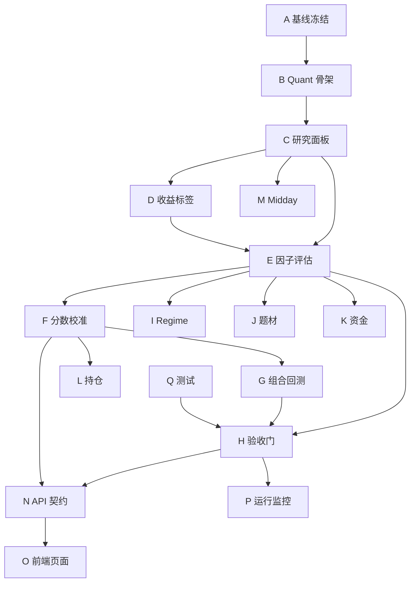

# Prism 量化升级需求拆分与任务清单

Date: 2026-04-28
Owner: Prism upgrade PM
Source: `docs/quant-upgrade-design-2026-04-27.md`
Scope: A 股短线研究、机会发现、持仓跟踪、执行辅助、量化验收、产品页面
Status: execution backlog

> 评审更新：这份文档保留为完整升级 backlog。第一阶段 P0 已确认收缩为“baseline + field audit + eligible universe + research panel + PIT + forward labels + factor evaluation + minimal backtest + report-only quant health”，不接生产排序、不替换 A/B/C、不做页面视觉、不做复杂题材状态机、不做 ML。执行第一阶段时以 `docs/quant-upgrade-p0-review-revision-2026-04-28.md` 为准。

## 0. 项目结论

Prism 这次升级的主线不是“继续加几个页面或规则”，而是把现有研究驾驶舱升级成一套可回测、可校准、可验收的投资决策系统。

本轮升级应按一条主路径推进：

```text
冻结当前基线 -> 生成研究面板 -> 生成收益标签 -> 评估因子有效性 -> 校准分数和分层 -> 做组合回测 -> 接入验收门 -> 接入前端决策面
```

PM 视角下，所有任务必须围绕四个问题验收：

1. 当前推荐有没有历史正期望。
2. A/B/C、闸门、题材、形态是否真的能解释收益和风险。
3. 每次策略改动是否能被回测和量化验收阻断。
4. 用户看到的是清晰动作，而不是复杂统计报表。

## 1. 总体版本规划

| 阶段 | 目标 | 核心交付 | 建议优先级 |
| --- | --- | --- | --- |
| Phase 0 | 冻结现状，建立 baseline | replay manifest、当前分层/闸门表现、基线报告 | P0 |
| Phase 1 | 把现有输出变成研究样本 | `daily_signal_panel`、PIT 检查、forward labels | P0 |
| Phase 2 | 验证现有因子是否有效 | IC、RankIC、分组收益、A/B/C 单调性、setup/regime breakdown | P0 |
| Phase 3 | 把经验分校准成风险收益分 | Prism Edge、Expected 3D/5D、Win Prob、Downside、信号半衰期 | P0 |
| Phase 4 | 做真实组合回测 | top N、仓位、成本、涨跌停、T+1、回撤、换手 | P0 |
| Phase 5 | 接入量化验收门 | `quant_health_score`、hard gates、CI/report-only gate | P0 |
| Phase 6 | 接入产品页面 | Command Center、Discovery、Stock、Portfolio、Review、Settings | P1 |
| Phase 7 | 题材、资金、regime 深化 | 题材状态机、资金归一化、regime/setup 策略表 | P1 |
| Phase 8 | 生产化与运维 | 任务运行、报表归档、数据质量监控、性能和文档 | P1 |

建议节奏：

| Sprint | 周期 | 主题 | 出口 |
| --- | --- | --- | --- |
| Sprint 0 | 2-3 天 | 基线冻结和字段审计 | 确认当前 artifact 能复现 |
| Sprint 1 | 1 周 | 研究面板 MVP | 样本面板和标签能生成 |
| Sprint 2 | 1 周 | 因子评估 MVP | 第一份 factor evaluation 报告 |
| Sprint 3 | 1 周 | 分数校准 MVP | 候选输出 Edge/Win/Downside |
| Sprint 4 | 1 周 | 组合回测 MVP | 新旧策略并排比较 |
| Sprint 5 | 1 周 | 验收门和评估接入 | `quant_health_score` 报告化 |
| Sprint 6 | 1-2 周 | 页面接入 | 用户面可读、可解释、可降级 |

## 2. Epic A: 基线冻结与现状审计

目标：在升级前固定 Prism 当前行为，避免后续不知道是规则改善还是数据漂移。

| ID | 任务 | 主要路径 | 交付物 | 验收标准 | 优先级 |
| --- | --- | --- | --- | --- | --- |
| A1 | 建立量化升级 baseline manifest | `data/evaluation/stock_analysis/manifest.json`、新增 `data/quant/baselines/` | `quant_baseline_manifest.json` | 固定 2024 回放样本、2026 最近运行样本、弱市样本、异常样本 | P0 |
| A2 | 复制并登记当前 replay artifact | `stock-screener/data/research_backfill/`、`stock-analyzer/data/daily_snapshots/`、`apps/data/command_brief/` | baseline artifact 清单 | 每条样本可追溯源文件、生成时间、交易日、lane | P0 |
| A3 | 输出当前分层和闸门表现审计 | `data/quant/reports/baseline_review_latest.md` | baseline review | 明确当前 A/B/C 是否单调、gate off 是否降低亏损、top N 是否扣成本为正 | P0 |
| A4 | 记录当前已知问题为 baseline fact | `docs/` 或 `data/quant/reports/` | known issues 清单 | A 档不优于 B/C、资金绝对值偏大票、主题 `其他` 偏高等问题被结构化记录 | P0 |
| A5 | 增加 baseline smoke 测试 | `tests/test_quant_baseline.py` | pytest | baseline manifest 引用的文件存在，关键字段可加载 | P0 |

开发注意：

- 不要先改评分规则。
- 先让旧系统行为可复现，后续每次改动才能比较。
- 当前 worktree 已有较多数据文件变更，开发时不要覆盖非本任务产物。

## 3. Epic B: Quant Package 与配置骨架

目标：建立独立量化脊柱，但不打断现有 `packages/screener`、`stock-analyzer`、`apps/control-panel`。

| ID | 任务 | 主要路径 | 交付物 | 验收标准 | 优先级 |
| --- | --- | --- | --- | --- | --- |
| B1 | 新增 `packages/quant` 包结构 | `packages/quant/` | `__init__.py`、模块空壳 | 可被 pytest/import 识别，不影响现有包 | P0 |
| B2 | 新增 schema 定义 | `packages/quant/schemas.py` | dataclass 或 TypedDict schema | 覆盖 signal、factor、label、regime、theme、backtest、health | P0 |
| B3 | 新增量化研究配置 | `data/config/quant-research.json` | 配置文件 | entry model、holding windows、成本、仓位、样本量、统计方式、gates 可配置 | P0 |
| B4 | 新增 feature registry | `packages/quant/feature_registry.py` | `factor_manifest.json` | 每个因子有名称、来源、类型、缺失策略、PIT 要求 | P0 |
| B5 | 新增 label registry | `packages/quant/label_registry.py` | `label_manifest.json` | 1/3/5/10 日 raw/net/excess、MAE/MFE、limit/suspend 标签定义清楚 | P0 |
| B6 | 增加目录初始化脚本 | `packages/quant/paths.py` 或公共 helper | `data/quant/*` 自动创建 | panels、labels、factors、models、backtests、reports、ledgers 路径统一 | P1 |

建议目录：

```text
packages/quant/
  __init__.py
  schemas.py
  paths.py
  build_research_panel.py
  evaluate_factors.py
  calibrate_scores.py
  run_portfolio_backtest.py
  report_quant_health.py
  feature_registry.py
  label_registry.py

data/config/quant-research.json

data/quant/
  baselines/
  panels/
  labels/
  factors/
  models/
  backtests/
  reports/
  ledgers/
```

## 4. Epic C: 研究面板 MVP

目标：把 scan、AI 二筛、自选股、午盘确认、总控简报转成可研究样本。

| ID | 任务 | 主要路径 | 交付物 | 验收标准 | 优先级 |
| --- | --- | --- | --- | --- | --- |
| C1 | 接入 canonical loader | `apps/scripts/prism_canonical.py`、`packages/quant/build_research_panel.py` | artifact loader adapter | `quant` 不直接散读不稳定路径，优先复用 canonical 入口 | P0 |
| C2 | 解析 screener scan/AI history | `stock-screener/data/ai_history/`、`stock-screener/data/stale_outputs/` | scan/AI 样本 rows | 每个候选有 code、rank、score、tier、setup、theme、gate、source_artifact | P0 |
| C3 | 解析 watchlist snapshots | `stock-analyzer/data/daily_snapshots/` | watchlist 样本 rows | 每个自选股有 action、score、signal、position、support/stop、source_lane=watchlist | P0 |
| C4 | 解析 midday verification | `stock-screener/data/midday_verification_result.json` 和历史文件 | midday 样本 rows | confirmed/downgraded/fresh_candidates 都进入样本，标记 baseline 是否存在 | P0 |
| C5 | 生成 `daily_signal_panel` | `data/quant/panels/daily_signal_panel.jsonl` | 面板文件 | 每行代表交易日 x 股票 x lane 的信号 | P0 |
| C6 | 增加 PIT 字段 | 同上 | `signal_timestamp`、`available_timestamp`、`decision_timestamp` | `decision_timestamp >= available_timestamp`，否则标记不可进入正式回测 | P0 |
| C7 | 增加数据质量 flags | 同上 | `data_quality_flags`、`pit_check_status` | 缺失价格、缺失资金、陈旧资金、不可证明 PIT、停牌/涨跌停都可标记 | P0 |
| C8 | 输出覆盖率报告 | `data/quant/reports/panel_coverage_latest.md` | coverage report | 样本量、日期覆盖、lane 覆盖、字段缺失率、PIT 失败率清楚 | P0 |
| C9 | 面板契约测试 | `tests/test_quant_research_panel.py` | pytest | 固定 fixture 能生成稳定 rows，关键字段不为空 | P0 |

`daily_signal_panel` 最小字段：

| 字段组 | 字段 |
| --- | --- |
| 身份 | `trade_date`、`code`、`name`、`source_lane`、`source_artifact` |
| 时间 | `signal_timestamp`、`available_timestamp`、`decision_timestamp` |
| 排序 | `rank`、`final_score`、`tier`、`entry_plan_type` |
| 分项 | `technical_score`、`capital_score`、`emotion_score`、`fundamental_score`、`risk_penalty` |
| 结构 | `setup_type`、`theme`、`strategy_bucket`、`execution_quality` |
| 环境 | `execution_gate_status`、`market_regime_score`、`theme_score` |
| 执行 | `trigger_price`、`stop_loss`、`position_cap` |
| 质量 | `pit_check_status`、`data_latency_policy`、`data_quality_flags` |

## 5. Epic D: 收益标签与价格对齐

目标：给每个信号生成可验证的未来收益、风险和执行约束标签。

| ID | 任务 | 主要路径 | 交付物 | 验收标准 | 优先级 |
| --- | --- | --- | --- | --- | --- |
| D1 | 盘点当前价格数据来源 | `stock-analyzer/data/`、`stock-screener/data/research_backfill/` | price source audit | 明确日线、分钟线、停牌、涨跌停数据来源和缺口 | P0 |
| D2 | 实现交易日 calendar | `packages/quant/label_registry.py` | trade calendar helper | 能从交易日找到 t+1/t+3/t+5/t+10 | P0 |
| D3 | 生成 next_open/next_close 标签 | `packages/quant/build_research_panel.py` 或 `label_registry.py` | `forward_return_labels.jsonl` | raw/net 1/3/5/10 日收益可生成 | P0 |
| D4 | 生成 excess return | 同上 | benchmark excess labels | 支持 HS300、CSI500、equal_weight_pool 至少一种基准 | P0 |
| D5 | 生成 MAE/MFE 标签 | 同上 | `mae_5d`、`mfe_5d` | 最大不利/有利波动按持有窗口计算 | P0 |
| D6 | 生成执行约束标签 | 同上 | `limit_blocked`、`suspended`、`hit_stop_loss` | 涨停买不到、跌停卖不出、停牌样本不会被当成可执行收益 | P0 |
| D7 | 成本模型配置化 | `data/config/quant-research.json` | buy/sell/slippage bps | 不允许脚本内硬编码交易成本 | P0 |
| D8 | 标签质量报告 | `data/quant/reports/label_coverage_latest.md` | label coverage | 标签缺失、价格缺失、执行不可用、窗口不足样本量清楚 | P1 |
| D9 | 标签契约测试 | `tests/test_quant_research_panel.py` | pytest | 固定价格 fixture 下收益、成本、MAE/MFE 结果正确 | P0 |

PM 风险点：

- 没有可靠分钟级数据前，盘中信号也先按下一交易日执行处理。
- 收盘后信号不能用当日收盘后才知道的数据去验证当日收益。
- PIT 失败样本允许出现在覆盖率报告，不允许进入正式因子评估和组合回测。

## 6. Epic E: 因子评估 MVP

目标：回答 Prism 现有因子到底有没有用。

| ID | 任务 | 主要路径 | 交付物 | 验收标准 | 优先级 |
| --- | --- | --- | --- | --- | --- |
| E1 | 实现 factor panel 构建 | `packages/quant/evaluate_factors.py` | `factor_panel.jsonl` | 从 `daily_signal_panel` 抽取标准因子矩阵 | P0 |
| E2 | 评估 `final_score` | 同上 | factor report | 输出 IC、RankIC、分组收益、Top-Bottom、样本量 | P0 |
| E3 | 评估 `capital_score` 和资金归一化 | 同上 | factor report | 比较绝对资金分 vs `main_flow_to_amount` 等归一化因子 | P0 |
| E4 | 评估 `execution_quality` | 同上 | factor report | 高执行质量是否提升胜率或降低 MAE | P0 |
| E5 | 评估 `tier` 单调性 | 同上 | tier report | A/B/C 1/3/5/10 日收益和 MAE 单调性清楚 | P0 |
| E6 | 评估 `setup_type x regime` | 同上 | setup/regime breakdown | 突破、回踩、低位反转、龙头延续在不同 regime 下表现清楚 | P0 |
| E7 | 评估 `execution_gate_status` | 同上 | gate breakdown | gate off/limited/on 时新仓收益、亏损、回撤差异清楚 | P0 |
| E8 | 评估 `theme_score/theme` | 同上 | theme factor report | 题材分是否带来超额，`其他` 是否稀释排序 | P1 |
| E9 | 增加 Newey-West 或 block bootstrap | 同上 | adjusted stats | 3/5/10 日重叠收益不能只用普通 t 值 | P0 |
| E10 | 增加 walk-forward 评估 | 同上 | rolling OOS report | 至少两个样本外窗口，样本内有效不能直接进 production | P0 |
| E11 | 输出因子评估报告 | `data/quant/reports/factor_evaluation_latest.md` | Markdown + JSON | 人能读、机器能接，列出 pass/candidate/block | P0 |
| E12 | 因子评估测试 | `tests/test_quant_factor_evaluation.py` | pytest | 分组收益、单调性、样本量不足、重叠标签标记都可测 | P0 |

第一版必须回答：

- `final_score` 的 RankIC 是多少。
- A/B/C 是否收益单调。
- gate off 时是否应该完全禁止新仓。
- 哪些 setup 在 trial/risk_on/risk_off 里有效。
- 资金分归一化前后哪个更有效。
- AI 二筛是否改善 scan 原始候选。
- 午盘确认和 downgrade 是否有后验价值。

## 7. Epic F: 分数校准与 Prism Edge

目标：把经验分变成期望收益、胜率、下行风险和证据强度。

| ID | 任务 | 主要路径 | 交付物 | 验收标准 | 优先级 |
| --- | --- | --- | --- | --- | --- |
| F1 | 实现 score calibration | `packages/quant/calibrate_scores.py` | `score_calibration_latest.json` | 原始分数可映射到 3D/5D 期望净超额收益 | P0 |
| F2 | 输出 win probability | 同上 | `win_prob_5d` | 同类 regime/setup/tier 下正收益概率可计算 | P0 |
| F3 | 输出 downside risk | 同上 | `downside_q05_5d`、`expected_mae_5d` | 下行风险来自历史分位和 MAE | P0 |
| F4 | 输出 sample confidence | 同上 | `confidence` | 样本量、稳定性、缺失率、PIT 合规决定置信度 | P0 |
| F5 | 输出 edge curve | 同上 | `edge_curve` | 1/3/5/10 日收益曲线可展示 | P0 |
| F6 | 输出 Alpha 衰减指标 | 同上 | `alpha_peak_day`、`signal_half_life_days`、`time_stop_days` | 信号有效期和时间止损可由历史曲线推导 | P0 |
| F7 | 定义 Prism Edge Score | 同上 | `prism_edge` | 由 expected return、win prob、downside、confidence、regime/liquidity/data penalty 合成 | P0 |
| F8 | 新 A/B/C 分层 | 同上 | `calibrated_tier` | 新分层样本外表现优于旧分层，至少不更差 | P0 |
| F9 | 输出校准报告 | `data/quant/reports/score_calibration_latest.md` | report | 旧分层 vs 新分层、分数桶收益、校准误差清楚 | P0 |
| F10 | 校准测试 | `tests/test_quant_score_calibration.py` | pytest | 样本量不足不会给高置信，负期望不会升 A | P0 |

产品输出字段：

| 字段 | 产品含义 |
| --- | --- |
| `prism_edge` | 当前量化优势 |
| `expected_3d_net` / `expected_5d_net` | 扣成本期望收益 |
| `win_prob_5d` | 五日正收益概率 |
| `downside_q05_5d` | 五日极端下行风险 |
| `expected_mae_5d` | 预期最大不利波动 |
| `evidence_strength` | 样本量和稳定性 |
| `regime_fit` | 当前市场是否适合该 setup |
| `time_stop_days` | 时间止损建议 |
| `position_cap_model` | 风险预算推导仓位上限 |

## 8. Epic G: 组合回测 MVP

目标：验证每天真的买入前 N 只后，组合层面是否可执行、是否值得做。

| ID | 任务 | 主要路径 | 交付物 | 验收标准 | 优先级 |
| --- | --- | --- | --- | --- | --- |
| G1 | 实现 portfolio backtest runner | `packages/quant/run_portfolio_backtest.py` | backtest JSON/MD | 可按配置跑一个完整窗口 | P0 |
| G2 | 支持 baseline 策略 | 同上 | `top_n_raw_score` | 每天买原始分前 N | P0 |
| G3 | 支持校准策略 | 同上 | `top_n_calibrated_edge` | 每天买 Prism Edge 前 N | P0 |
| G4 | 支持 gate filtered 策略 | 同上 | `gate_filtered_top_n` | gate off 不开新仓，limited 降仓 | P0 |
| G5 | 支持 setup/regime 策略 | 同上 | `setup_regime_model` | 不同 regime 只允许特定 setup | P1 |
| G6 | 支持 theme leader 策略 | 同上 | `theme_leader_model` | 强题材只买 leader/co-leader | P1 |
| G7 | 支持持仓和换仓规则 | 同上 | positions ledger | max positions、holding days、rebalance、stop loss、time stop | P0 |
| G8 | 支持仓位和暴露约束 | 同上 | risk ledger | single position cap、theme exposure、industry exposure | P0 |
| G9 | 支持执行约束 | 同上 | execution ledger | T+1、涨跌停、停牌、成本、滑点进入收益 | P0 |
| G10 | 输出组合指标 | `data/quant/reports/portfolio_backtest_latest.md` | total return、annualized、drawdown、sharpe、calmar、win rate、turnover | P0 |
| G11 | 输出分 regime 表现 | 同上 | regime breakdown | risk_off/trial/risk_on/theme_driven 等状态下表现清楚 | P0 |
| G12 | 回测测试 | `tests/test_quant_portfolio_backtest.py` | pytest | 成本、涨跌停、T+1、仓位上限、top N 选择可测 | P0 |

组合回测第一版不要追求复杂优化，先回答：

- 每天买前 5 只扣成本后能不能赚钱。
- 新 Edge 排序是否优于旧 raw score。
- gate 过滤是否降低回撤。
- 弱市场是否少亏，强市场是否没有严重错过。
- 换手和成本是否把纸面收益吃掉。

## 9. Epic H: Quant Acceptance Gate

目标：每次改动股票逻辑前，先知道有没有把系统变差。

| ID | 任务 | 主要路径 | 交付物 | 验收标准 | 优先级 |
| --- | --- | --- | --- | --- | --- |
| H1 | 实现 quant health report | `packages/quant/report_quant_health.py` | `quant_health_latest.json/md` | 汇总数据、因子、分层、组合、执行、产品安全 | P0 |
| H2 | 接入现有 evaluation | `apps/scripts/evaluate_stock_analysis.py` | scorecard 新字段 | 新增 `quant_health_score`，第一版 report-only | P0 |
| H3 | 实现 tier monotonicity gate | 同上 | gate result | A 长期弱于 B/C 时失败 | P0 |
| H4 | 实现 net return gate | 同上 | gate result | 主策略样本外扣成本为负且差于 baseline 时失败 | P0 |
| H5 | 实现 regime safety gate | 同上 | gate result | 弱环境新仓亏损显著扩大时失败 | P0 |
| H6 | 实现 sample size gate | 同上 | gate result | 样本量不足却给高置信时失败 | P0 |
| H7 | 实现 drawdown gate | 同上 | gate result | 最大回撤显著高于 baseline 时失败 | P0 |
| H8 | 实现 PIT/data leakage gate | 同上 | gate result | `decision_timestamp < available_timestamp` 或无法证明可用时失败 | P0 |
| H9 | 实现 overlap significance gate | 同上 | gate result | 重叠收益没有 Newey-West/block bootstrap/walk-forward 时失败 | P0 |
| H10 | 实现 alpha decay gate | 同上 | gate result | 超过半衰期仍维持高置信进攻建议时失败 | P1 |
| H11 | 实现执行真实性 gate | 同上 | gate result | 未考虑成本、涨跌停、停牌、T+1 却宣称可执行时失败 | P0 |
| H12 | 增加 gate 测试 | `tests/test_quant_health_gate.py` | pytest | 每个 gate 至少一个 pass/fail fixture | P0 |

第一版 gate 策略：

- 默认 report-only，不直接阻断主流程。
- 参数保存、策略规则改动、发版前必须生成报告。
- 当指标稳定后，再逐步把 P0 gate 改为 hard gate。

`quant_health_score` 建议权重：

| 维度 | 权重 |
| --- | ---: |
| 数据可研究性 | 15 |
| 因子有效性 | 20 |
| 分层校准 | 20 |
| 组合表现 | 20 |
| 执行真实性 | 15 |
| 产品安全 | 10 |

## 10. Epic I: Regime 升级

目标：把 execution gate 从规则判断升级为可验证的市场状态模型。

| ID | 任务 | 主要路径 | 交付物 | 验收标准 | 优先级 |
| --- | --- | --- | --- | --- | --- |
| I1 | 定义 regime schema | `packages/quant/schemas.py` | `market_regime_table` schema | risk_off、trial、risk_on、theme_driven、reversal_window、distribution | P0 |
| I2 | 抽取现有 execution gate 因子 | `packages/screener/parameters.py`、`packages/screener/ai_screening.py` | regime features | broad_score、positive_ratio、strong_ratio、candidate_score 等进入 panel | P0 |
| I3 | 增加市场广度因子 | `packages/quant/feature_registry.py` | breadth features | breadth_ratio、strong_stock_ratio、limit_up_down_balance | P1 |
| I4 | 增加风险偏好因子 | 同上 | risk appetite features | 高 beta、题材股、连板股、候选池强度差 | P1 |
| I5 | 输出 regime daily table | `data/quant/factors/market_regime_table.jsonl` | daily regime | 每个交易日一个 regime 状态和分数 | P0 |
| I6 | 验证 gate 行为 | `evaluate_factors.py` | gate evaluation | gate off/limited/on 的收益和回撤证据清楚 | P0 |
| I7 | 生成 setup-regime 决策表 | `data/quant/models/setup_regime_policy.json` | policy | 哪些 regime 允许哪些 setup，仓位上限多少 | P1 |
| I8 | 接入产品字段 `regime_fit` | API + 前端 | candidate/stock field | 用户能看到当前市场是否匹配这只票 | P1 |

## 11. Epic J: 题材模型升级

目标：让题材从粗分类变成可验证的赚钱效应状态机。

| ID | 任务 | 主要路径 | 交付物 | 验收标准 | 优先级 |
| --- | --- | --- | --- | --- | --- |
| J1 | 审计当前主题分类 | `packages/screener/scan.py`、`stock-screener/data/ai_screening_result.json` | theme audit report | `其他` 占比、常见误分、主线稀释问题清楚 | P0 |
| J2 | 建立题材别名和归一化表 | `data/config/theme-taxonomy.json` | taxonomy | 行业、概念、别名、排除词可配置 | P1 |
| J3 | 生成 theme_state_table | `packages/quant/feature_registry.py` | `theme_state_table.jsonl` | 每日每主题 heat、breadth、leader、persistence、crowding、decay | P1 |
| J4 | 定义题材状态机 | 同上 | emerging/confirming/accelerating/crowded/decaying/dead | 每个状态有可解释规则和阈值 | P1 |
| J5 | 定义题材内角色 | 同上 | leader/co_leader/follower/laggard/risk_tail | 个股能落到题材角色 | P1 |
| J6 | 评估 theme_score 有效性 | `evaluate_factors.py` | theme report | 题材热度和角色是否解释后续超额收益 | P1 |
| J7 | Discovery 页面接入 | `apps/web/src/app/discovery/page.tsx`、API | 主题热力升级 | 显示主题状态、龙头、扩散、退潮风险 | P1 |
| J8 | Stock 页面接入 `theme_role` | `apps/web/src/app/stock/[code]/page.tsx` | 个股题材角色 | 用户知道是龙头、跟风、补涨还是风险尾部 | P1 |

## 12. Epic K: 资金因子升级

目标：避免绝对净流入天然偏向大市值股票，把资金信号变成可比较因子。

| ID | 任务 | 主要路径 | 交付物 | 验收标准 | 优先级 |
| --- | --- | --- | --- | --- | --- |
| K1 | 盘点资金字段来源 | `stock-analyzer/data/fund_flow_cache/`、`packages/screener/scan.py` | flow data audit | 明确金额单位、时间戳、缺失、陈旧字段 | P0 |
| K2 | 实现 `main_flow_to_amount` | `feature_registry.py` | normalized factor | 主力流入 / 成交额 | P0 |
| K3 | 实现 `main_flow_to_float_mv` | 同上 | normalized factor | 主力流入 / 流通市值 | P1 |
| K4 | 实现 `flow_z_20d` | 同上 | normalized factor | 相对自身 20 日 z-score | P1 |
| K5 | 实现 `flow_industry_rank` | 同上 | normalized factor | 行业内资金强度分位 | P1 |
| K6 | 实现 `flow_persistence_3d` | 同上 | normalized factor | 连续资金强度 | P1 |
| K7 | 实现资金背离标签 | 同上 | `flow_price_divergence` | 资金强价格弱、价格强资金弱进入风险解释 | P1 |
| K8 | 接入 confidence penalty | `calibrate_scores.py` | data quality penalty | 缺失或陈旧资金不允许作为强正面证据 | P0 |
| K9 | 页面展示资金时效 | Stock/Portfolio/Discovery | freshness badge | 用户看得到资金是今日确认还是历史参考 | P0 |

## 13. Epic L: 持仓与自选股升级

目标：`stock-analyzer` 聚焦“已关注股票的动作管理”，而不是另一个选股器。

| ID | 任务 | 主要路径 | 交付物 | 验收标准 | 优先级 |
| --- | --- | --- | --- | --- | --- |
| L1 | 定义 position state | `stock-analyzer/`、canonical | `position_state` | 空仓、观察、试仓、持有、减仓、退出 | P1 |
| L2 | 定义 thesis state | 同上 | `thesis_state` | 逻辑成立、边际变弱、失效、等待确认 | P1 |
| L3 | 定义 risk budget | 同上 | `risk_budget` | 单票允许亏损预算和仓位上限 | P1 |
| L4 | 定义 stop policy | 同上 | `stop_policy` | 价格止损、逻辑止损、时间止损 | P1 |
| L5 | 增加 decision memory | `data/quant/ledgers/` 或 watchlist state | decision memory ledger | 上次建议、实际走势、是否打脸 | P1 |
| L6 | 自选股 lifecycle/diff | `stock-analyzer/data/daily_snapshots/` | watchlist lifecycle report | 用户知道动作为什么变化 | P1 |
| L7 | Portfolio 页面接入 | `apps/web/src/app/portfolio/page.tsx` | 持仓状态看板 | 优先处理、跟踪、观察按量化状态分组 | P1 |
| L8 | Stock 页面接入 | `apps/web/src/app/stock/[code]/page.tsx` | 单股持仓决策层 | Decision Light、Prism Edge、Position Cap、Stop Policy | P1 |

## 14. Epic M: Midday 升级

目标：盘中验证不再只是“有没有确认”，而是能验证 promotion/downgrade 的后验价值。

| ID | 任务 | 主要路径 | 交付物 | 验收标准 | 优先级 |
| --- | --- | --- | --- | --- | --- |
| M1 | 明确 morning baseline required | `packages/screener/midday_verify.py` | baseline status | 无早盘基线时标记 fresh scan，不冒充 confirmation | P0 |
| M2 | 扩展弱市 baseline 覆盖 | 同上 | target coverage | gate off/limited 时 top caution 也进入午盘跟踪 | P0 |
| M3 | 提取 intraday delta features | 同上 + quant panel | delta features | 价格、成交、资金、题材、排名、score_delta | P1 |
| M4 | 生成 confirmation labels | `label_registry.py` | confirmation label | confirmed 后 1/3/5 日收益 | P1 |
| M5 | 生成 downgrade effectiveness | `evaluate_factors.py` | downgrade report | 被降级股票是否真的表现更差 | P1 |
| M6 | 生成 promotion safety | 同上 | fresh candidate report | 盘中新晋候选是否容易追高亏损 | P1 |
| M7 | Discovery 页面展示午盘证据 | `apps/web/src/app/discovery/page.tsx` | midday panel | fresh/confirmed/downgraded 各自有证据强度和执行建议 | P1 |

## 15. Epic N: API 与数据契约升级

目标：让量化输出可以稳定进入 Next.js 前端和旧 FastAPI API。

| ID | 任务 | 主要路径 | 交付物 | 验收标准 | 优先级 |
| --- | --- | --- | --- | --- | --- |
| N1 | 扩展后端 view model | `apps/control-panel/dashboard_data.py` | quant fields | Today/Watchlist/Opportunities/Review/Stock 可带量化字段 | P0 |
| N2 | 扩展 TypeScript 类型 | `apps/web/src/lib/types.ts` | `QuantDecision`, `QuantEvidence` 等类型 | 前端编译通过，字段可选降级 | P0 |
| N3 | 增加 `/api/quant/health` | `apps/control-panel/app.py` | health endpoint | 返回 latest quant health summary | P1 |
| N4 | 增加 `/api/quant/reports` 预览入口 | app + preview | report endpoint | 可预览 factor/backtest/health 报告 | P1 |
| N5 | Stock profile 增加量化层 | `build_stock_profile_view()` | quant evidence section | `primary_detail` 可携带 Decision Light 和二级证据 | P0 |
| N6 | Opportunities 增加排序依据 | `build_opportunities_view()` | edge/evidence fields | StockCard 可展示 Expected Edge、Evidence Strength | P0 |
| N7 | Review 增加模型复盘 | `build_review_view()` | quant review cards | 本周模型是否变好、哪些规则被打脸 | P1 |
| N8 | API 契约测试 | `apps/control-panel/tests/` | contract tests | 老字段不破，新字段可选存在，空量化报告可降级 | P0 |

数据契约建议：

```ts
type DecisionLight = "green" | "yellow" | "gray" | "red";

type QuantDecision = {
  decision_light?: DecisionLight;
  prism_edge?: number;
  expected_3d_net?: number;
  expected_5d_net?: number;
  win_prob_5d?: number;
  downside_q05_5d?: number;
  expected_mae_5d?: number;
  evidence_strength?: string;
  evidence_sample_size?: number;
  regime_fit?: string;
  theme_role?: string;
  calibrated_tier?: "A" | "B" | "C";
  position_cap_model?: string;
  time_stop_days?: number;
  quant_status?: "available" | "insufficient_sample" | "pit_failed" | "stale" | "unavailable";
};
```

## 16. Epic O: 前端页面升级

目标：用户看到清晰动作，复杂量化证据放入第二层。

### O1. Command Center 首页

| ID | 任务 | 主要路径 | 展示内容 | 验收标准 | 优先级 |
| --- | --- | --- | --- | --- | --- |
| O1.1 | Hero 增加今日正期望判断 | `apps/web/src/app/page.tsx` | 今日是否有正期望机会、整体 gate、仓位上限 | 没有正期望时清楚说观察/不做 | P1 |
| O1.2 | Action Queue 增加 Decision Light | `ActionRow`、types | green/yellow/gray/red | 用户不用看 IC 也知道可做/试错/观察/禁止 | P1 |
| O1.3 | Summary Cards 增加量化健康 | page + API | quant health、edge count、risk-off filter | 量化报告缺失时优雅降级 | P1 |
| O1.4 | 风险提醒接入 hard gates | RiskAlert | PIT、样本不足、弱市亏损扩大 | gate fail 不被包装成普通提示 | P1 |

### O2. Discovery 观察池

| ID | 任务 | 主要路径 | 展示内容 | 验收标准 | 优先级 |
| --- | --- | --- | --- | --- | --- |
| O2.1 | 候选卡增加 Expected Edge | `StockCard` 或新组件 | `Expected 5D`、`Prism Edge`、`Evidence Strength` | 只显示核心 2-3 个字段，不淹没用户 | P1 |
| O2.2 | Pipeline 支持按 Edge/Tier/Theme 分组 | `discovery/page.tsx` | calibrated tier、setup/regime | 可看 old score vs calibrated edge 差异 | P1 |
| O2.3 | 主线热力升级 | Theme panel | 题材状态、龙头、扩散、退潮风险 | `其他` 占比高时提示分类质量问题 | P1 |
| O2.4 | 午盘确认量化证据 | Discovery side panel | confirmed/downgraded 后验表现 | 没有 morning baseline 时不显示成 confirmation | P1 |

### O3. Stock Detail 统一股票页

| ID | 任务 | 主要路径 | 展示内容 | 验收标准 | 优先级 |
| --- | --- | --- | --- | --- | --- |
| O3.1 | 首屏增加 Decision Light | `apps/web/src/app/stock/[code]/page.tsx` | 可做/试错/观察/禁止 | 首屏 5 秒内能读懂动作 | P1 |
| O3.2 | 决策 tab 增加量化摘要 | 同上 | Prism Edge、Expected 5D、Downside、Position Cap | 字段缺失时显示证据不足，不胡编 | P1 |
| O3.3 | 证据 tab 增加量化二级层 | 同上 | 样本量、regime、setup、theme role、edge curve | 深度用户能追溯依据 | P1 |
| O3.4 | 持仓 tab 增加 stop policy | 同上 | 价格止损、逻辑止损、时间止损 | 时间止损来自 half-life | P1 |
| O3.5 | 追问回答接入量化上下文 | ask followup | 当前 Edge、downside、gate 状态 | LLM 解释不能覆盖量化 gate | P1 |

### O4. Portfolio 持仓页

| ID | 任务 | 主要路径 | 展示内容 | 验收标准 | 优先级 |
| --- | --- | --- | --- | --- | --- |
| O4.1 | 分组按 position_state/thesis_state 增强 | `portfolio/page.tsx` | 优先风控、可继续、等待确认 | 持仓管理不再只是 action 文案分组 | P1 |
| O4.2 | 增加风险预算卡 | Portfolio metrics | 总风险预算、单票仓位上限、超限提醒 | 仓位来自模型或明确降级为人工规则 | P1 |
| O4.3 | 增加 decision memory | Portfolio/Stock | 上次建议、实际走势、是否打脸 | 复盘闭环能从持仓页进入 | P1 |

### O5. Review 复盘页

| ID | 任务 | 主要路径 | 展示内容 | 验收标准 | 优先级 |
| --- | --- | --- | --- | --- | --- |
| O5.1 | 增加 Quant Health 区块 | `review/page.tsx` | total score、六维分、hard gates | 模型好坏一屏可读 | P1 |
| O5.2 | 增加规则打脸榜 | Review cards | 哪些规则样本外失效 | 不再只显示流程分和变化回放 | P1 |
| O5.3 | 增加新旧策略对比 | Review compare | raw score vs edge、baseline vs latest | 可看收益、回撤、换手、胜率 | P1 |
| O5.4 | 增加下载/预览报告 | PreviewDrawer | factor/backtest/health markdown | 用户能打开原始研究报告 | P1 |

### O6. Settings 运维页

| ID | 任务 | 主要路径 | 展示内容 | 验收标准 | 优先级 |
| --- | --- | --- | --- | --- | --- |
| O6.1 | 新增 quant 任务按钮 | `settings/page.tsx`、`TASK_DEFINITIONS` | build panel、evaluate factors、calibrate、backtest、health | 可手动运行并看日志 | P1 |
| O6.2 | 参数页增加 quant config 编辑 | settings | `quant-research.json` 编辑 | 保存前校验 JSON 和关键字段 | P1 |
| O6.3 | 参数保存挂 report-only gate | API | 保存后自动提示 gate 结果 | 高风险参数调整不会静默上线 | P1 |
| O6.4 | 最近运行记录支持 quant report preview | settings + preview | 运行详情、日志、产物链接 | 运维闭环完整 | P1 |

## 17. Epic P: 任务运行、报告归档与监控

目标：让 quant spine 成为日常可运行链路，而不是一次性脚本。

| ID | 任务 | 主要路径 | 交付物 | 验收标准 | 优先级 |
| --- | --- | --- | --- | --- | --- |
| P1 | 增加 shell entrypoints | `apps/scripts/` 或 `packages/quant/` | `run_quant_panel.sh` 等 | 可从命令行单独跑每阶段 | P1 |
| P2 | 接入 control-panel task runner | `TASK_DEFINITIONS` | 后台任务 | Settings 可启动 quant 任务 | P1 |
| P3 | 归档每次量化产物 | `data/quant/reports/`、`data/history/` | timestamped reports | latest + timestamp 双路径 | P1 |
| P4 | 增加 freshness/source cards | API + 前端 | source cards | 量化报告陈旧时页面提示 | P1 |
| P5 | 增加失败告警摘要 | health report | failure summary | PIT/data leakage/gate fail 优先展示 | P1 |
| P6 | 增加性能预算 | docs/tests | runtime note | 面板构建、因子评估、回测耗时有记录 | P2 |

## 18. Epic Q: 测试与质量保障

目标：每个核心统计结论都能用 fixture 复现，每个产品页面都能空数据降级。

| ID | 任务 | 路径 | 验收标准 | 优先级 |
| --- | --- | --- | --- | --- |
| Q1 | research panel contract test | `tests/test_quant_research_panel.py` | 固定 artifact 生成稳定 signal rows | P0 |
| Q2 | PIT gate test | 同上 | `decision_timestamp < available_timestamp` 被拦截 | P0 |
| Q3 | label calculation test | 同上 | 1/3/5/10 日收益、成本、MAE/MFE 正确 | P0 |
| Q4 | factor evaluation test | `tests/test_quant_factor_evaluation.py` | IC、RankIC、分组、单调性、样本量不足 | P0 |
| Q5 | overlapping label test | 同上 | 重叠收益必须标记 adjusted 状态 | P0 |
| Q6 | calibration test | `tests/test_quant_score_calibration.py` | 负期望不升 A，样本不足不高置信 | P0 |
| Q7 | portfolio backtest test | `tests/test_quant_portfolio_backtest.py` | top N、成本、涨跌停、T+1、仓位约束 | P0 |
| Q8 | quant health gate test | `tests/test_quant_health_gate.py` | 每个 hard gate 有 pass/fail fixture | P0 |
| Q9 | API contract test | `apps/control-panel/tests/` | 新字段可选，旧字段不破 | P0 |
| Q10 | frontend typecheck | `apps/web` | `pnpm typecheck` 通过 | P1 |
| Q11 | smoke test | repo root | `pytest -q` 通过 | P0 |

## 19. 依赖关系



关键依赖：

- 没有 Phase 0 baseline，不应开始调参。
- 没有 PIT 和 labels，不应宣称因子有效。
- 没有因子评估，不应接入 Prism Edge。
- 没有组合回测，不应让新策略影响生产排序。
- 没有 API 契约，不应大面积改前端页面。

## 20. P0 最小可用闭环

如果只做第一阶段最小闭环，必须完成这些：

| 顺序 | 任务 | 结果 |
| --- | --- | --- |
| 1 | A1-A5 基线冻结 | 当前系统表现可复现 |
| 2 | B1-B5 quant 骨架 | 有独立研究包和配置 |
| 3 | C1-C9 研究面板 | 现有输出可研究 |
| 4 | D1-D9 收益标签 | 信号可对齐未来收益 |
| 5 | E1-E12 因子评估 | 知道哪些旧因子有效 |
| 6 | F1-F10 分数校准 | 有 Edge/Win/Downside |
| 7 | G1-G12 组合回测 | 知道每天买前 N 是否有效 |
| 8 | H1-H12 量化验收门 | 策略改动能被报告化阻断 |
| 9 | N1/N2/N5/N6/N8 API 契约 | 前端可读取量化字段 |
| 10 | O1/O2/O3 关键页面接入 | 用户能看到可做/试错/观察/禁止 |

第一阶段完成后，Prism 至少要能回答：

- 当前 `final_score` 的 RankIC 是多少。
- A/B/C 是否收益单调。
- gate off 是否真的应该禁止新仓。
- 哪些 setup 在哪些 regime 有优势。
- 资金分归一化后是否更有效。
- 题材分高是否有超额收益。
- AI 二筛是否改善 scan 原始候选。
- 午盘确认和降级是否有后验价值。
- 每天推荐前 5 只扣成本后是否优于 baseline。
- 当前推荐仓位是否来自风险收益证据，而不是经验口感。

## 21. 开发看板建议

建议按以下泳道管理：

| 泳道 | 包含任务 |
| --- | --- |
| Data & PIT | A、C、D、K |
| Research & Stats | E、F、I、J、M |
| Backtest & Gate | G、H、Q |
| Backend/API | N、P |
| Frontend/Product | O、L |
| Ops & Docs | P、文档、运行手册 |

每张开发卡必须包含：

- 需求背景。
- 输入数据路径。
- 输出产物路径。
- 是否影响用户页面。
- 是否影响现有任务运行。
- 验收标准。
- 测试命令。
- 回滚方式。

## 22. Definition of Done

一个任务不能只算“代码写完”，需要满足：

1. 有产物：JSON/JSONL/Markdown/API 字段/页面至少一种可见交付。
2. 有验收：对应测试或报告能证明结果。
3. 有降级：数据缺失、样本不足、PIT 失败时不胡乱给强结论。
4. 有可追溯：输出能追到 source artifact。
5. 有产品语言：前端展示的是动作建议，而不是把统计术语直接扔给用户。
6. 不破坏旧链路：`pytest -q`、关键 smoke、Next typecheck 按影响范围执行。

## 23. 第一批开工建议

建议下一步直接开这 8 张 P0 卡：

1. `A1` 新建 `quant_baseline_manifest.json`。
2. `B1-B3` 新建 `packages/quant`、schemas、`data/config/quant-research.json`。
3. `C1-C5` 生成第一版 `daily_signal_panel.jsonl`。
4. `C6-C8` 增加 PIT 检查和 coverage report。
5. `D2-D4` 生成 1/3/5/10 日 forward return labels。
6. `E1-E5` 先评估 `final_score`、`capital_score`、`tier`。
7. `E9-E11` 加重叠收益调整标记和第一份 factor report。
8. `H1-H2` 把 `quant_health_score` 先以 report-only 接入 evaluation。

这 8 张卡完成后，再决定是否先做校准和回测，还是先修复暴露出来的字段缺口。

## 24. 不建议现在做的事

- 不要一开始上复杂机器学习模型。
- 不要先改大面积前端 UI，再补数据证据。
- 不要在没有 PIT 检查前宣称回测有效。
- 不要只看胜率，不看赔率、回撤、成本、换手。
- 不要把 LLM 解释当作排序依据。
- 不要因为某个窗口回测好看，就直接改生产规则。
- 不要让证据不足的候选显示成高置信机会。

## 25. 最终验收口径

这轮系统升级真正完成时，Prism 应从：

```text
这个票分数高，题材不错，但市场闸门关闭，所以只观察。
```

升级为：

```text
这个票原始分数高，但在当前 risk_off regime 下，同类突破跟随样本 5 日扣成本期望收益为负，历史最大不利波动偏高，因此不允许新仓。若市场切换到 trial 且回踩确认，才重新进入 B 档观察。
```

也就是说，Prism 的产品表达仍然简洁，但内部每个动作都能回答：

- 为什么是这个动作。
- 历史上这个动作靠不靠谱。
- 风险在哪里。
- 这次最多做多少。
- 什么条件下系统承认自己错了。
